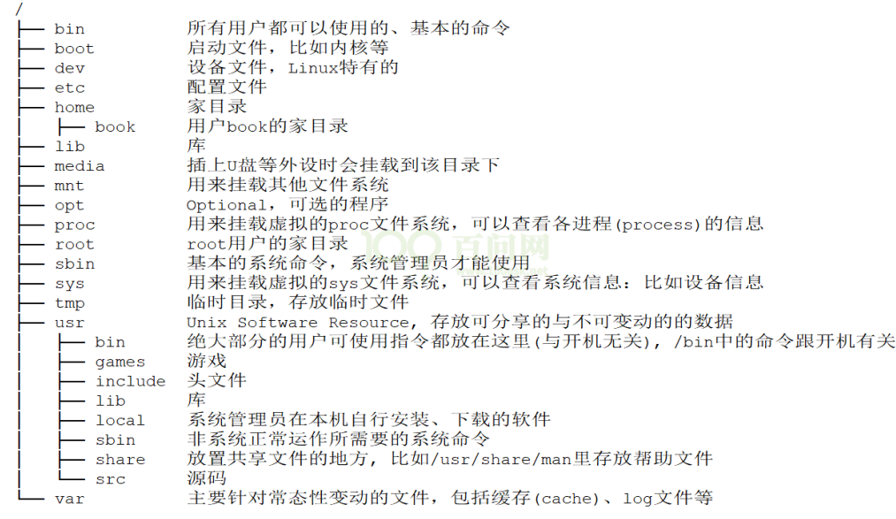
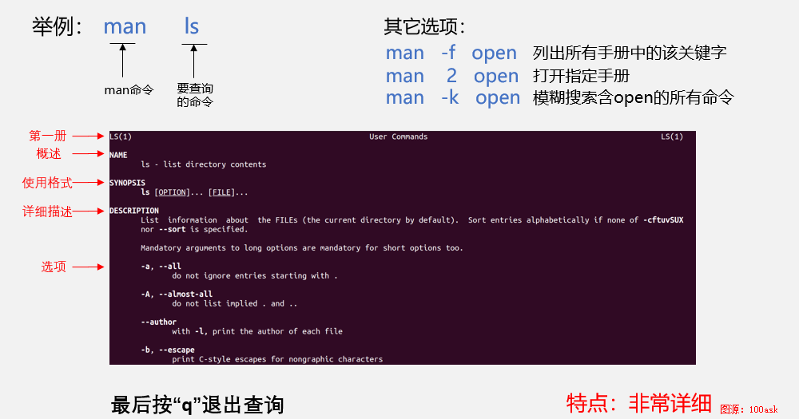
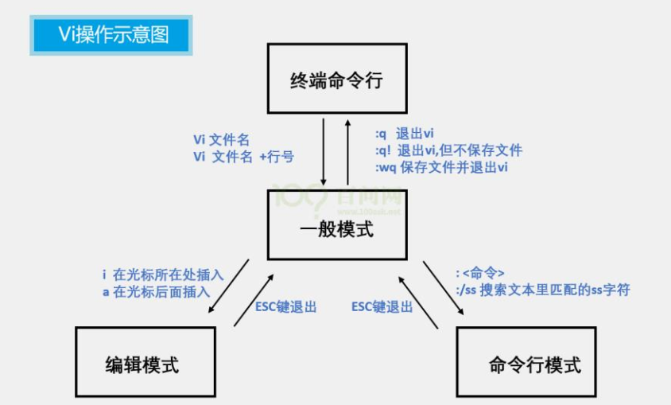

# ARM & Linux 基础学习记录

编辑整理 by [Staok](https://github.com/Staok)

本文大部分内容摘自“100ask imx6ull”开发板的配套资料（如《嵌入式Linux应用开发完全手册_韦东山全系列视频文档全集》等等），侵删。进行了精髓提取，方便日后查阅。过于基础的内容不会在此提及。如有错误恭谢指出！

------

## 目录

[TOC]

------

## Linux 一般开发步骤

*p.s 本应放在最后，刻意写在前头。*

Bootloader、Linux 内核、根文件系统、APP 等等软件，需要在Ubuntu中编译；但是阅读、修改这些源码时，在Windows下会比较方便。

所以工作日常开发流程如下：

PC 端，使用 source insight 编、改源码 —>传—> Linux端，操作 Ubuntu 对修改好的源码进行编译、制作 —>下载—> 嵌入式端，在 Linux 板子上运行、测试。

分步来说就是：

1.  在 Windows 上阅读、研究、修改，修改后，上传（推荐 FileZilla）到 Ubuntu ；
2.  在 Ubuntu 上编译、制作（推荐使用 MobaXterm 通过 SSH 远程登陆 Ubuntu）；
3.  把制作好的可执行程序下载到开发板上运行、测试。

u-boot、Linux内核，Windows 和 Ubuntu 各存一份。根文件系统使用 buildroot （或 Busybox 或 Yocto）制作，它无需放在 Windows 上。

## Linux OS 相关

*p.s 关于在 VM 虚拟机中安装 Linux 发行版系统和在PC上安装 Linux 发行版系统，用时再在网上随查随用。*

*p.s 若仅用于开发或者只使用命令行的形式，一般在 MobaXterm 或者 Xshell 中使用 SSH 连接 Linux 系统（如 Ubuntu）来进行系统操作。*

*p.s 鼠标退出 VM ，按 ctrl + alt。*

[Linux 系统使用教程 - 菜鸟教程](https://www.runoob.com/linux/linux-tutorial.html)，当字典用。

### Linux 文件系统

#### 文件目录

Ubuntu 中的目录遵循 FHS 标准(Filesystem Hierarchy Standard， 文件系统层次标准)。它定义了文件系统中目录、文件分类存放的原则、定义了系统运行所需的最小文件、目录的集合，并列举了不遵循这些原则的例外情况及其原因。 FHS 并不是一个强制的标准，但是大多的 Linux、 Unix 发行版本遵循 FHS。  

这些目录简单介绍如下。



#### 文件属性

终端中执行 "ls -al" 命令则给出每个文件完整属性信息。文件属性示意图如下 。


-   第一个字符表示“文件类型”，它是目录、文件或链接文件等。如下表所示。

| d    | 目录                                     |
| ---- | ---------------------------------------- |
| -    | 文件                                     |
| l    | 链接文件                                 |
| b    | 设备文件里的可供存储的接口设备           |
| c    | 设备文件里的串行端口设备，如鼠标、键盘等 |

-   文件类型后面的 9 个字符以 3 个为一组：

    1.  第一组表示“文件所有者的权限”；
    2.   第二组表示“用户组的权限”；
    3.   第三组表示“其他非本用户组的权限”。   

    每组都是 rwx 的组合， 其中 r 代表可读， w 代表可写， x 代表可执行； 如果没有对应的权限，就会出现减号 -。  

-   连接数： 表示有多少文件名连接到此节点。  

-   文件所有者：表示这个文件的“所有者的账号”。

-   文件所属用户组。

-   文件大小：表示这个文件的大小，默认单位是 B(字节)。

-   文件最后被修改的时间： 这个文件的创建文件日期或者是最近的修改日期。

-   文件名：对应文件的文件名。  

### Linux Shell

#### 概况

Shell 的意思是“外壳”，在 Linux 中它是一个程序，比如/bin/sh、 /bin/bash 等。它负责接收用户的输入，根据用户的输入找到其他程序并运行。比如我们输入“ ls”并回车时， shell 程序找到“ ls”程序并运行，把结果打印出来。Shell 有很多种实现，我们常用 bash。  

命令提示符如下图。


根目录： "/" ；家目录： "~" ；上一级目录： ".." ；当前目录： "." ；上一次目录："-"。执行当前目录的  "app" 应用程序： "./app" 。 

#### 常用命令

-   以下命令的多个选项可以任意按需组合。
-   tab 键自动补全命令和文件或目录的全名。
-   多个命令写在一行并自动逐个执行，命令之间加 && 符号。
-   输入路径全名的中途，按两下 tab 键显示当前目录下的内容。
-   [Shell 教程 - 菜鸟教程](https://www.runoob.com/linux/linux-shell.html)，[Linux 命令大全 - 菜鸟教程](https://www.runoob.com/linux/linux-command-manual.html)，当字典用。

加餐：

-   给 root 用户设置密码，并在用户间切换：

    `sudo passwd root` 给 root 设置密码

    `输入 （book）当前用户密码`

    `输入 root 新设置的密码，两次`

    成功

    `su root` 切换到 root 用户

    `su book` 切回

-   进入 默认的 root 用户：

    `sudo su` 进入

    `exit` 退出 root，进入普通用户

##### 略过的命令

`pwd`、`cd`、`mkdir`（-p 选项指示连续创建目录及其子目录）、`rmdir`（不能删除非空目录）、`cat`、`touch`、`clear`、`echo`（往文件写内容 `echo none > /sys/class/leds/cpu/trigger`）。

##### 获取命令帮助： --help/man

命令后加 --help 选项，获取此命令的所有选项和其释义。详情如下图。


命令的完整手册，命令前加 man，提供命令、API、概念、配置文件等帮助信息。详情如下。

man 手册一共有 9 册，每一册专注一个方面。如下表。

| **section** | **名称**                 | **说明**                   |
| ----------- | ------------------------ | -------------------------- |
| 1           | 用户命令                 | 用户可操作的命令           |
| 2           | 系统调用                 | 内核提供的函数(查头文件)   |
| 3           | 库调用                   | 常用的函数库               |
| 4           | 特殊文件                 | 设备文件(/dev下)和特殊文件 |
| 5           | 文件格式和约定           | 对一些文件进行解释         |
| 6           | 游戏程序                 | 游戏程序                   |
| 7           | 杂项                     | 包括宏包和约定等           |
| 8           | 系统管理员使用的管理命令 | 通常只有系统管理员可以使用 |
| 9           | 内核相关                 | Linux内核相关文件          |

每一册都细分为语法说明、详细说明、作者说明、版权信息等章节。如下表。

| **段名**       | **主要内容**                     |
| -------------- | -------------------------------- |
| NAME           | 命令、数据名称的简短说明         |
| SYNOPSIS       | 简短的命令语法说明               |
| DESCRIPTION    | 最为权威和全面的使用说明         |
| EXAMPLES       | 使用本命令或数据的一些参考示例   |
| AUTHOR         | 作者                             |
| REPORTING BUGS | 报告相关的错误信息               |
| COPYRIGHT      | 版权                             |
| SEE ALSO       | 与本命令或数据相关的其他参考说明 |



##### 显示目录文件和文件夹：ls

-l 显示完整属性信息；-a 显示隐藏文件；-h 文件和文件夹大小以 K/M/G 单位显示。一个例子如图。


##### 统计目录每个文件大小：du

统计指定目录内每个文件和文件夹大小：`du -ah ~/Videos`。-a 表显示隐藏文件，-h 表大小以 K/M/G 单位显示。

显示指定文件所占空间：

```bash
# du log2012.log 
300     log2012.log
```

##### 复制文件或文件夹：cp

-   -r 表示递归目录下所有文件；-d 如果源文件为链接文件，只复制链接文件而不是实际文件；-i 增加特殊情况的讯问，如同名时会询问是否覆盖等；-f 强制覆盖。
-   拷贝 dir1 内所有文件到 dir2：`cp dir1/* dir2` 或者 `cp -r dir1/ dir2/`；
-   复制目录时常用：`cp -rid dir_a dir_b`。

##### 移动/重命名文件/文件夹：mv

直接举例：

-   `mv file1 dir1 dir2`，将文件 file1 和 目录 dir1 移动到目录 dir2 里面。
-   `mv file1 file_1`，将文件 file1 重命名为 file_1。

##### 删除文件或文件夹：rm

-   -r 递归；-f 强制；-i 询问（个人建议常用）。
-   删除目录：`rm -rf dir_a`。
-   喜闻乐见的删库跑路：`rm -rf /*`。

##### 改变文件权限和属性

-   改变文件所属用户组 ：chgrp

    将 install.log 文件的用户组改为 hy 用户组：`chgrp hy install.log`。注意 hy 用户组必须要在/etc/group 文件内存在才可以。  

    -R : 进行递归的持续更改，也连同子目录下的所有文件、目录都更新成为这个用户组之意。常常用在更改某一目录内所有文件的情况。  

-   改变文件的所有者：chown

    例子：`chown bin install.log`、`chown book:book install.log`，改变 install.log 文件的所有者为 bin，改变 install.log 文件的所有者和用户组为 book 和 book。

    改变文件所有者和用户组的这两个命令的应用场景：复制文件，由于复制行为会复制执行者的属性和权限，因此复制后需要改变文件所属用户、用户组等。  

    -R：也是递归子目录。

-   改变文件权限：chmod

    使用 u、 g、 o 三个字母代表 user、 group、 others 3 中身份。此外 a 代表 all，即所有身份。范例：`chmod u=rwx,go=rx .bashrc`；

    也可以增加或去除某种权限，“ +”表示添加权限，“ -”表示去除权限：  `chmod a+w .bashrc`、`chmod a-x .bashrc`、`chmod +x app`。

    数字的方式就不细说了：用 4 代表 r 权限，2 代表 w 权限，1 代表 x 权限；owner = rwx = 4+2+1 = 7；例子：`chmod 777 .bashrc`。

##### 查找/搜索：find

-   格式：`find 目录名 选项 查找条件`；如果没有指定目录，则为当前目录查找
-   举例，在某目录用名字查找名为 test1.txt 的文件：`find /home/book/dira/ -name " test1.txt "`；按格式查找：`-name " *.txt "`；
-   其他高级用法很多，这里举例，查找 x 天内有变动的文件：`find /home/book -mtime -2`，查找/home目录下两天内有变动的文件。  

##### 文件内搜索：grep

-   估计不常用。格式：`grep [选项] [查找模式] [文件名]`；
-   `grep -rn "字符串" 文件名`。字符串：要查找的字符串；文件名：要查找的目标文件，如果是 * 符号则表示查找当前目录下的所有文件和目录；r(recursive) 递归查找；n(number) 显示目标位置的行号；-w 全字匹配；
-   在test1.txt中查找字符串abc grep -rn "abc" * 在当前目录递归查找字符串abc：`grep -n "abc" test1.txt`；
-   第一个命令的结果传入第二个命令，即在 grep 的结果中再次执行 grep 搜索：`grep “ABC” * -nR | grep “ \.h”`，搜索包含有 "ABC" 的头文件。

##### 压缩打包：gzip、bzip2、tar、7z

-   单文件压缩、解压：

    -   小文件：gzip （.gz）
    -   大文件（压缩比高）：bzip2 （.bz2）

    上述两个的选项：-l (list) 列出压缩文件内容；-k (keep) 保留压缩或解压的源文件；-d (decompress) 解压压缩文件。

    例子：

    -   查看：`gzip -l pwd.1.gz`；
    -   压缩：`gzip -k guesswhat.iso`；
    -   解压：`gzip -kd pwd.1.gz`。

    注：不加 -k 选项，在操作完后不会保留源文件；都只能压缩单文件。

-   多文件、目录的压缩和解压：tar

    -   -c (create)：表示创建用来生成文件包 。压缩。
    -   -x：表示提取，从文件包中提取文件。解压。
    -   -t：可以查看压缩的文件。查看。
    -   -z：使用 gzip 方式进行处理，它与”c“ 结合就表示压缩，与”x“ 结合就表示解压缩。
    -   -j：使用 bzip2 方式进行处理，它与”c“ 结合就表示压缩，与”x“ 结合就表示解压缩。
    -   -v (verbose)：详细报告 tar 处理的信息。
    -   -f (file)：表示文件，后面接着一个文件名。 -C <指定目录> 解压到指定目录。  

    例子：（选项前可以不加 "-"，以下还是加上的）

    -   查看：tar -tvf dira.tar.gz；
    -   压缩（目录）：`tar -czvf dira.tar.gz dira`；或者 `tar -cjvf dira.tar.gz dira`；前者使用 gzip （czvf），后者使用 bzip2 （cjvf）；
    -   解压：`tar -xzvf dira.tar.gz -C /home/book`，加 -C 指定目录，不加就是解压到当前目录；
    -   tar 打包、 bzip2 压缩：`tar -cjvf dira.tar.bz2 dira`，把目录 dira 压缩、打包为 dira.tar.bz2 文件。

-   7z 高压工具
    -   工具安装：`sudo apt-get install p7zip`。
    -   解压：`7z x <压缩包名.7z>` 解压到压缩包命名的目录下。
    -   压缩：`7z a pack.7z 1.jpg dir1` 将 1.jpg 和 文件夹 dir1 压缩成一个 7z 包 pack.7z。

##### 网络命令：ifconfig  

`ifconfig`：查看当前正在使用的网卡，及其 IP；-a 查看所有网卡；

修改相应网卡的 IP 地址：`ifconfig <网卡名> 192.168.1.123` 。

测试路由：`ping 8.8.8.8`

测试 DNS 服务：`ping www.baidu.com`。DNS 的设置比较简单，8.8.8.8 是好记好用的 DNS 服务器，修改 Ubuntu 中的/etc/resolv.conf 文件，内容如下：`nameserver 8.8.8.8`。

##### 查看文件类型：file

`file 文件名`确定其机器码是适合 x86 平台的，还是 arm 平台的。举例：

```bash
file ~/.bashrc     为ASCII 编码的text类型
file ~/.vimrc      为UTF-8 Unicode 编码的text类型
file ~/Pictures/*  如图形文件JPEG/PNG/BMP格式
file ~/100ask/     为directory表明这是一个目录
file /bin/pwd      出现 ELF 64-bit LSB executable，即为ELF格式的可执行文件
file /dev/*        出现character special(字符设备文件)、 block special(块设备文件)等
```

##### 查找应用程序位置：which

`which pwd` 定位到 /bin/pwd；`which gcc` 定位到 /user/bin/gcc。

`whereis pwd` 可得到可执行程序的位置和手册页的位置。

##### 任务后台执行/任务查看

-   在命令的最后，加一个 & 符号，即可放到后台运行，

    常用任务管理命令：

    `jobs` 查看任务，返回任务编号 n 和进程号

    `bg %n` 将编号为 n 的任务转后台，并运行

    `fg %n` 将编号为 n 的任务转前台，并运行

    `ctrl+z` 挂起当前任务

    `ctrl+c` 结束当前任务

    例如：更多操作详情看[这里](https://blog.csdn.net/zxh2075/article/details/52932885)。

    执行 `ping www.baidu.com &`，再按 ctrl + z，显示 `[1]+  Stopped                 ping www.baidu.com`，表示此任务编号为 [ 1 ]，接着键入 `bg %1`，让此任务继续执行并转入后台执行，再键入 `fg %1`，将其转入前台执行，然后 ctrl + c 结束此任务。

-   `ps` 查看当前哪些任务在后台执行，-l 显示 任务的 PID 号。详情如下图。

    

-   `kill -9 <进程 ID>` 结束进程指定进程 ID 的进程。

##### 文件系统挂载查看：df

`df -Th` 列出文件系统类型、容量和哪个硬盘挂载在这里的情况。

第一列指文件系统的名称，第二列指1KB为单位的总容量，第三列指以使用空间，第四列指剩余空间，最后一栏是磁盘挂载所在目录。

```bash
$ df
Filesystem     1K-blocks    Used      Available Use% Mounted on 
/dev/sda6       29640780    4320600   23814492  16%       / 
...
```

##### 分区查看和设置：fdisk

用时现学，网上资料足多。

##### 文件系统挂载：mount

mount 命令用来挂载各种支持的文件系统协议到某个目录下。[Linux mount 命令-菜鸟教程](https://www.runoob.com/linux/linux-comm-mount.html)

举例：

-   将 /dev/hda1 挂在 /mnt 之下 `mount /dev/hda1 /mnt`。
-   将 /dev/hda1 用唯读模式挂在 /mnt 之下 `mount -o ro /dev/hda1 /mnt`。
-   将 /tmp/image.iso 这个光碟的 image 档使用 loop 模式挂在 /mnt/cdrom之下。用这种方法可以将一般网络上可以找到的 Linux 光 碟 ISO 档在不烧录成光碟的情况下检视其内容 `mount -o loop /tmp/image.iso /mnt/cdrom`。
-   卸载挂载 `umount /mnt`。

##### 内核模块管理：kmod

Linux 有许多功能是通过模块的方式，你可以将这些功能编译成一个个单独的模块，待用时再分别载入它们到 kernel。这类可载入的模块，通常是设备驱动程序。

-   `lsmod` 列出已安装系统的模块。
-   `insmod kmod.ko` 用于手动安装模块；-f 强制（不检查目前 kernel 版本与模块编译时的 kernel 版本是否一致），更多命令：
    -   -f 　不检查目前kernel版本与模块编译时的kernel版本是否一致，强制将模块载入。
    -   -k 　将模块设置为自动卸除。
    -   -m 　输出模块的载入信息。
    -   -o <模块名称> 　指定模块的名称，可使用模块文件的文件名。
    -   -p 　测试模块是否能正确地载入kernel。
    -   -s 　将所有信息记录在系统记录文件中。
    -   -v 　执行时显示详细的信息。
    -   -x 　不要汇出模块的外部符号。
    -   -X 　汇出模块所有的外部符号，此为预设置。
-   `rmmod` 卸载某个已安装的模块。
-   `modinfo` 查看某个模块的详细信息。
-   `modprobe` 自动安装模块，并自动尝试解决依赖，比 insmod 聪明；-f 强制安装，-r 卸载模块，更多命令：
    -   -a或--all 　载入全部的模块。
    -   -c或--show-conf 　显示所有模块的设置信息。
    -   -d或--debug 　使用排错模式。
    -   -l或--list 　显示可用的模块。
    -   -r或--remove 　模块闲置不用时，即自动卸载模块。
    -   -t或--type 　指定模块类型。
    -   -v或--verbose 　执行时（载入或者卸载）显示详细的信息。
    -   -V或--version 　显示版本信息。
    -   -help 　显示帮助。

##### 杂项

-   显示日期和日历： `data`， `cal`。

-   显示系统信息：`uname -a`。

-   显示系统内存使用情况：`free -h`。

-   动态的显示系统进程信息（相当于任务管理器界面）：`top -d  2`，-d 表示刷新时间，单位秒。详情如下图。

    

-   关闭驱动程序的 printk 打印信息：`echo "1 4 1 7" > /proc/sys/kernel/printk`。

-   将存于 buffer 中的资料强制写入硬盘中：`sync`。Linux 系统中欲写入硬盘的资料有的时候为了效率起见，会写到 filesystem buffer 中，这个 buffer 是一块记忆体空间，如果欲写入硬盘的资料存于此 buffer 中，而系统又突然断电的话，那么资料就会流失了，sync 指令会将存于 buffer 中的资料强制写入硬盘中。sync 命令是在关闭Linux系统时使用的。

-   重启：`reboot`。

-   关机：`halt`立即关机；`shutdown -t 10`，关机，-t 表示关机倒计时，单位秒。

### Vim 编辑器

功能：打开、新建和保存文件；文本编辑；多行、列间复制、粘贴和删除；查找和替换。

意义：开发中，尤其对于大型项目并不常用，但是在需要临时修改、现场调试和没有 GUI 形式的编辑器等等的时候，可以快速进行一些简单文本编辑。

##### 一图以蔽之



一般模式 用于光标移动、复制、粘贴和删除等；命令行模式 用于输入保存、退出、查找和替换等控制命令，在一般模式打一个冒号再输入命令。

注：当不知道处于何种模式时，按 ESC 键返回到一般模式。可以在 Ubuntu 中安装中文输入法。

Vim 编辑器的配置，请看 "vi编辑器的配置_摘自100ask.txt" 文件。

##### 在 一般模式 的更多指令

-   单击 o 键，在当前光标所在行的下方新建一行，并进入编辑模式。
-   单击 0（数字零） 光标移至当前行行首；$ 光标移至当前行行末；1gg 跳到第一行的行首，就是文件头（xgg 就是跳到第x行的行首）；G 跳到文件结尾。
-   ctrl + f 上翻页，ctrl + b 下翻页。
-   yy 复制当前行(y:yank(复制))；xyy 复制当前行及其后的x-1行；p 粘贴(p:paste) ；dd //删除光标所在行(d:delete) 。
-   u 撤销上一步操作；ctrl + r 恢复，回退到前一个命令。
-   针对 Ubuntu 界面来说，ctrl + "-" ，减小字号；ctrl + shift + "+"，增大字号。

##### 在 命令行模式 的更多命令

-   查找：`:/pattern` 从光标开始处向文件尾搜索字符串 "pattern"，后按 n （在同一个方向重复上一次搜索命令）或 N （在反方向重复上一次搜索命令）；从当前光标位置开始搜索，若光标在文件开头，则为全文搜索。
-   替换：`:%s/p1/p2/g` 将文件中所有的 p1 均用 p2 替换；`:%s/p1/p2/gc` 替换时需要确认。释义，“ s“ 全称： substitute 替换；“ g“ 全称： global 全局；“ c“ 全称： confirm， 确认。
-   新打开一个文件：`:sp <file>`纵向分屏 或 `:vsp <file>`横向分屏，此时会同屏新增一个窗口；切换这多个窗口的方法（循环移动）：`ctrl + w，w`（先按 ctrl + w，再按键w），在多文件编程时，切换不同的窗口很实用。让鼠标可以在多个屏幕间切换：`:set mouse=a`；在某个窗口输入`:q`，为退出此窗口。
-   跳转到第 n 行：`:n`。

一日，一人，代码前坐禅，贤者模式，顿悟，曰：整个键盘，都是 Vim 的快捷键。

##### VI 编辑器的配置

```
摘自100ask
cd /etc/vim
cp vimrc ~/.vimrc
cd ~
gedit .vimrc
在.vimrc中加入如下内容：

"关闭兼容功能
set nocompatible 
"显示行号
set number
"编辑时 backspace 键设置为2个空格
set backspace=2
"编辑时 tab 键设置为4个空格
set tabstop=4
"设置自动对齐为4个空格
set shiftwidth=4
"搜索时不区分大小写
set ignorecase
"搜索时高亮显示
set hlsearch
```

### Ubuntu 下的包管理

包管理系统的功能和优点大致相同，但打包格式和工具会因平台（不同的 Linux 发行版）而异，如下表所示。

| 操作系统 | 格式        | 工具                          |
| -------- | ----------- | ----------------------------- |
| Debian   | .deb        | apt, apt-cache, apt-get, dpkg |
| Ubuntu   | .deb        | apt, apt-cache, apt-get, dpkg |
| CentOS   | .rpm        | yum                           |
| Fedora   | .rpm        | dnf                           |
| FreeBSD  | Ports, .txz | make, pkg                     |

一般来说Ubuntu 下很多软件是需要先自行提供源码，使用源码自行编译，编译完成以后使用命令” install” 来安装到系统中。当然 Ubuntu 下也有其它的软件安装方法，使用得最多的方法就是自行编译源码后进行安装，尤其是嵌入式 Linux 开发。  

自行对软件源码编译的一个好处是可以针对不同平台进行编译和部署。

我们利用软件包管理系统可以直接下载并安装所有通过认证的软件，其中 Ubuntu 下我们用的最多的下载工具： APT 下载工具， APT 下载工具可以实现软件自动下载、配置、安装二进制或者源码的功能。  在我们使用 APT 工具下载安装或者更新软件的时候，首先会在下载列表中与本机软件进行对比，看一下需要下载哪些软件，或者升级哪些软件，默认情况下 APT 会下载并安装最新的软件包，被安装的软件包所依赖的其它软件也会被下载安装或者更新，非常智能省心。  

#### 包管理工具 apt

```bash
# "package" 替换为 包名。
sudo apt-get update                         更新源
sudo apt-get install package                安装包
sudo apt-get remove package                 删除包
sudo apt-cache search package               搜索软件包
sudo apt-cache show package                 获取包的相关信息，例如说明、大小、脚本等
sudo apt-get install package --reinstall    重新安装包
sudo apt-get -f install                     修复安装
sudo apt-get remove package --purge         删除包，包括配置文件等
sudo apt-get build-dep package              安装相关的编译环境
sudo apt-get upgrade                        更新已安装的包
sudo apt-get dist-upgrade                   升级系统
sudo apt-cache depends package              了解使用该包依赖那些包
sudo apt-cache rdepends package             查看该包被那些包依赖
sudo apt-get source package                 下载该包的源代码
```

#### 换源 和 添加系统变量

换源：

1.  首先备份源列表：`sudo cp /etc/apt/sources.list /etc/apt/sources.list_backup`；

2.  编辑 /etc/apt/sources.list 文件，在文件最前面添加阿里云镜像源：

    ```
    # 阿里源
    deb http://mirrors.aliyun.com/Ubuntu/ bionic main restricted universe multiverse
    deb http://mirrors.aliyun.com/Ubuntu/ bionic-security main restricted universe multiverse
    deb http://mirrors.aliyun.com/Ubuntu/ bionic-updates main restricted universe multiverse
    deb http://mirrors.aliyun.com/Ubuntu/ bionic-proposed main restricted universe multiverse
    deb http://mirrors.aliyun.com/Ubuntu/ bionic-backports main restricted universe multiverse
    deb-src http://mirrors.aliyun.com/Ubuntu/ bionic main restricted universe multiverse
    deb-src http://mirrors.aliyun.com/Ubuntu/ bionic-security main restricted universe multiverse
    deb-src http://mirrors.aliyun.com/Ubuntu/ bionic-updates main restricted universe multiverse
    deb-src http://mirrors.aliyun.com/Ubuntu/ bionic-proposed main restricted universe multiverse
    deb-src http://mirrors.aliyun.com/Ubuntu/ bionic-backports main restricted universe multiverse
    ```
    
3.  更新源：`sudo apt-get update`。

添加系统变量：

-   临时：终端中键入：`export PATH=$PATH:<目录>`，重启后丢失。
-   永久（只对当前用户有效）：改 ~/.bashrc 文件，在行尾添加：`export PATH=$PATH:<目录>`，然后终端键入 `source ~/.bashrc` 使之生效，即可。

## Linux 驱动和应用的体验

### 100ask Ubuntu 主机 的配置工作

-   配置 100ask Ubuntu 主机 的环境：

    先执行：`sudo apt-get update`

    再执行：

    ```bash
    wget --no-check-certificate -O Configuring_ubuntu.sh https://weidongshan.coding.net/p/DevelopmentEnvConf/d/DevelopmentEnvConf/git/raw/master/Configuring_ubuntu.sh && sudo chmod +x Configuring_ubuntu.sh && sudo ./Configuring_ubuntu.sh
    ```

-   在 NAT 网络下，要想开发板能通过 NFS 挂载 Ubuntu 主机，需要修改 mountd 端口为 9999。详情看《嵌入式Linux应用开发完全手册_韦东山全系列视频文档全集》的 P94 第二篇 4.1.3。

-   修改 VM 虚拟机 中 Ubuntu 主机 的 IP 为固定的。详情看 P95 第二篇 4.1.4。（可以不做）

-   开发板网络设置。详情看 P117 第二篇 6.4。

-   开发板挂载 Ubuntu 主机 的 NFS目录。详情看 P123 第二篇 6.7。

### 准备交叉编译工具链

先准备好 Linux Ubuntu 平台运行的的针对 ARM 平台的编译器 gcc-linaro-6.2.1-2016.11-x86_64_arm-linux-gnueabihf。

使用 Vim 工具编辑 ~/.bashrc 文件，在最后添加：

```bash
export ARCH=arm
export CROSS_COMPILE=arm-linux-gnueabihfexport
export PATH=$PATH:/home/<用户目录>/gcc-linaro-6.2.1-2016.11-x86_64_arm-linux-gnueabihf/bin  
```

并在终端键入 `source ~/.bashrc` 使其生效。

然后在终端测试一下 `arm-linux-gnueabihf-gcc -v`。

### 第一个应用

略，略略略~。

### 第一个驱动

注意：

-   驱动程序用到 Linux 内核的 API，编译驱动程序之前要先编译内核。
-   编译驱动时用的内核和嵌入式板子上运行的内核，要一致（不一致的话，不能正常安装 .ko 模块，强装会有意想不到的问题）。
-   嵌入式板子更换内核（重新编译）时，也要把其他所有驱动程序都重新编译，替换原来的。

#### 编译内核

在 Linux 源码目录里执行：

```bash
make mrproper
make xxx_imx6ull_defconfig
make zImage -j4
make dtbs
```

释义：

-   make mrproper 命令会删除所有的编译生成文件、内核配置文件(.config文件)和各种备份文件，所以几乎只在第一次执行内核编译前才用这条命令。make clean 命令则是用于删除大多数的编译生成文件，但是会保留内核的配置文件.config，还有足够的编译支持来建立扩展模块。所以你若只想删除前一次编译过程的残留数据，只需执行 make clean 命令。总而言之，make mrproper删除的范围比 make clean 大，实际上，make mrproper 在具体执行时第一步就是调用 make clean。
-   配置文件位于内核源码 arch/arm/configs/ 目录。

得到 内核文件 和 设备树文件 这两个文件：

```bash
arch/arm/boot/zImage
arch/arm/boot/dts/100ask_imx6ull-14x14.dtb
```

#### 编译内核模块

在 Linux 源码目录里执行：

```bash
make ARCH=arm CROSS_COMPILE=arm-linux-gnueabihf- modules
sudo make ARCH=arm INSTALL_MOD_PATH=/home/book/nfs_rootfs modules_install
```

释义：

-   第一条，如果设置好了 ARCH 和 CROSS_COMPILE 环境变量，直接键入 `make modules` 也可。
-   第二条命令是把模块安装到 /home/book/nfs_rootfs 目录下备用 ， 会得到 /home/book/nfs_rootfs/lib/modules 目录。

#### 更新目标板

有很多种方式传输文件，详见 "PC 与 嵌入式板 传输文件的方式汇总" 章节。将 zImage 、 100ask_imx6ull-14x14.dtb 和 lib 目录分别放到嵌入式板子的 /boot 、 /boot 和 /lib 目录，比如使用方便的 nfs 文件系统；然后存储 `sync`，重启 `reboot`。

#### 编写、编译驱动

按照驱动程序的编写规则，写好驱动程序（hello_drv.c）、相应的测试程序（hello_drv_test.c），以及准备好 Makefile 文件。

举例 Makefile 文件：

```makefile
# 修改为 Linux 内核所在目录
KERN_DIR = /home/book/100ask_roc-rk3399-pc/linux-4.4

all:
	make -C $(KERN_DIR) M=`pwd` modules 
	$(CROSS_COMPILE)gcc -o hello_drv_test hello_drv_test.c 

clean:
	make -C $(KERN_DIR) M=`pwd` modules clean
	rm -rf modules.order
	rm -f hello_drv_test

obj-m	+= hello_drv.o
```

确保三个环境变量 ARCH、CROSS_COMPILE 和 PATH（交叉编译器的 /bin 目录）都以就绪。

执行 `make`。产生 驱动程序的内核模块（hello_drv.ko）和 测试程序 ARM 端的二进制可执行文件，共两个文件，转移到 嵌入式目标板子上。

安装驱动程序模块 `insmod hello_drv.ko`。

在 `lsmod` 命令下可以看到 hello_drv 模块；执行 `cat /proc/devices` 可以看到 对应的设备及其主设备号；执行 `ls -l /dev/<设备名称>` 可以看到此设备的主、此设备号等更多信息。

执行测试程序进行验证。

### 学至此的一点启示，也许不对

芯片厂家（大概）应该都会提供完整的 U-boot、 Linux 内核、芯片上硬件资源的驱动程序。

看韦东山的 imx6ull 板子的裸机开发源码，可以得知，启动文件.s需要看懂，都大同小异，然后官网会提供所有寄存器的.h文件及其结构体，然后每个外设似乎还会提供初始化、配置的代码（因为韦的源码里面，外设底层配置代码为英文注释的，99%的概率是官方提供的），这样就好了嘛，外设的底层驱动可以都扒官方例程。

### 构建系统简约步骤

这里只简约说明编译步骤，并非详细使用说明（以后的系列文章可能会有）。

#### 每个部分单独手动简约步骤

以下工作进行前，先配置好环境变量和开发链工具等工作，详见 "准备交叉编译工具链" 章节。

1、编译 u-boot，配置文件位于 u-boot 源码的 configs/ 目录，生成 u-boot 启动镜像 u-boot-dtb.imx。在 Uboot 目录下执行：

```bash
make distclean
make mx6ull_14x14_evk_defconfig
make
```

2、编译内核，配置文件位于内核源码 arch/arm/configs/ 目录，生成 arch/arm/boot/zImage 内核文件 和 arch/arm/boot/dts/xxx_imx6ull-14x14.dtb 设备树文件。在 Linux 内核目录下执行：

```bash
Linux-4.9.88$ make mrproper
Linux-4.9.88$ make xxx_imx6ull_defconfig
Linux-4.9.88$ make zImage -j4
Linux-4.9.88$ make dtbs
```

3、编译内核模块，并把模块文件导入 /home/book/nfs_rootfs/lib/modules 目录。在 Linux 内核目录下执行：

```bash
make ARCH=arm CROSS_COMPILE=arm-linux-gnueabihf- modules
sudo make ARCH=arm INSTALL_MOD_PATH=/home/book/nfs_rootfs modules_install
```

#### 使用 Buildroot 构建系统简约步骤

Linux 平台上有许多开源的嵌入式 linux 系统构建框架，这些框架极大的方便了开发者进行嵌入式系统的定制化构建，目前比较常见的有 OpenWrt, Buildroot, Yocto 等等。其中 Buildroot 功能强大，使用简单，而且采用了类似于 linux kernel 的配置和编译框架。

制作根文件系统方法比较：

-   Busybox。Busybox本身包含了很了 Linux 命令，但是要编译其他程序的话需要手工下载、编译，如果它需要某些依赖库，你还需要手工下载、编译这些依赖库。如果想做一个极简的文件系统，可以使用 Busybox 手工制作。  
-   Buildroot。它是一个自动化程序很高的系统，可以在里面配置、编译内核，配置编译 u-boot、配置编译根文件系统。在编译某些APP时，它会自动去下载源码、下载它的依赖库，自动编译这些程序。Buildroot 的语法跟一般的 Makefile 语法类似，很容易掌握。  
-   Yocto。NXP、 ST等公司的官方开发包是使用Yocto，Yocto 语法复杂，容量大（10GB 以上），编译时间长。

Buildroot 是一组 Makefile 和补丁，可简化并自动化地为嵌入式系统构建完整的、可启动的 Linux 环境（包括 bootloader、 Linux 内核、包含各种 APP 的文件系统）。 Buildroot 运行于 Linux 平台，可以使用交叉编译工具为多个目标板构建嵌入式 Linux 平台。 Buildroot 可以自动构建所需的交叉编译工具链，创建根文件系统，编译 Linux 内核映像，并生成引导加载程序用于目标嵌入式系统，或者它可以执行这些步骤的任何独立组合。例如，可以单独使用已安装的交叉编译工具链，而 Buildroot 仅创建根文件系统。  

[学习更多关于 Buildroot 知识请参考这里](http://wiki.100ask.org/Buildroot)。

扩展学习：

-   buildroot 下进入 menuconfig 包选择配置配置界面 `make menuconfig`。
-   buildroot 下单独编译 u-boot `make uboot-rebuild`。
-   buildroot 下单独编译内核 `make menuconfig`。
-   buildroot 下进入内核 make menuconfig 配置选项界面 `make linux-menuconfig`。
-   buildroot 下单独编译某个软件包 `make <pkg>-rebuild`。
-   buildroot 下进入 busybox 配置界面 `make busybox-menuconfig`。
-   buildroot 下生成系统 sdk，最后生成的目录在 output/images/ 目录下 `make sdk`。

构建根文件系统：

在 Buildroot 目录下执行：

```bash
make clean
make xxx_imx6ull_defconfig
make all
```

漫长长长（2~6个小时，视电脑性能）的等待后编译完成。

可以配置多个不同的配置文件 xxx_imx6ull_defconfig，比如有的带 qt5 ，有的用于构建最精简的文件系统，有的用于另一块板子等待。

编译成功后文件输出路径为 output/images：

```
buildroot 20xx.xx
├── output
    ├── images
        ├── xxx_imx6ull-14x14.dtb             <--设备树文件
        ├── rootfs.ext2                       <--ext2 格式根文件系统
        ├── rootfs.ext4 -> rootfs.ext2        <--ext2 格式根文件系统
        ├── rootfs.tar
        ├── rootfs.tar.bz2                    <--打包并压缩的根文件系统，用于 NFSROOT 启动
        ├── sdcard.img                        <--完整的 SD 卡系统镜像
        ├── u-boot-dtb.imx                    <--u-boot 镜像
        └── zImage                            <--内核镜像
```

对应的文件更新到嵌入式板子的对应位置，或者使用 sdcard.img 或者 emmc.img 完整系统映像文件烧入 sd卡 或 emmc。

## PC 与 嵌入式板 传输文件的方式汇总

**（如有更多方法将会补充）**

### 网络传输：ETH/WiFi

#### SSH

使用 MobaXterm 或 FileZilla 等等，通过 SSH 链接 Linux 板，进行文件传输。

#### NFS

NFS 将服务端的文件系统目录树映射到客户端，而在客户端访问该目录树与访问本地文件系统没有任何差别。

如果你使用的是 VMware NAT 方式，假设 Windows IP 为192.168.1.100，在嵌入式 Linux 板子上执行以下命令(注意：必须指定 port 为2049、 mountport 为9999)：

```bash
mount -t nfs -o nolock,vers=3,port=2049,mountport=9999 192.168.1.100:/home/book/nfs_rootfs /mnt
```

如果你使用的是 VMware 桥接方式，假设 Ubuntu IP 为192.168.1.100，在嵌入式 Linux 板子上执行以下命令：

```bash
mount -t nfs -o nolock,vers=3 192.168.1.100:/home/book/nfs_rootfs /mnt
```

mount 成功之后 ， 嵌入式 Linux 板子在 /mnt 目录下读写文件时， 实际上访问的就是 Ubuntu 中的 /home/book/nfs_rootfs 目录，所以嵌入式 Linux 板子和 Ubuntu 之间通过 NFS 可以很方便地共享文件。

#### tftp

略。需要时再看。《嵌入式Linux应用开发完全手册_韦东山全系列视频文档全集V2.8.pdf》P357、P373。

### USB 传输：

最 x 的方法 U 盘拷贝。

NXP 公司给 IMX6ULL 提供了烧写工具： mfgtools。或者对于 imx6ull 使用 100ask 开发的 100ask imx6ull flashing tool（详看 《【主线剧情01】ARM IMX6ULL 基础学习记录》的 "100ASK IMX6ULL Flashing Tool 工具使用" 章节）。

### 串口传输：rz/sz 命令

在"板砖"工地上网口、USB 口统统没有，那我们还可以使用串口。

注意： rz/sz 命令不稳定，不可靠，在没有其他办法的情况下再用它。 rz/sz 命令传输速率太小，适合传输小文件，不适合大文件。 

#### 上位机往板子发：rz

在 MobaXterm 里面通过串口连接并登录嵌入式 Linux 板子，然后输入 `rz` 命令，此时终端会提示等待接收，此时在 MobaXterm 里面鼠标右键会弹出一个选择框，点击 Send file using Z-modem 来选择要传输文件。

#### 板子往上位机发：sz

嵌入式 Linux 板子启动进入 Linux 后，在串口中执行命令 `sz <要发送的文件>`，然后按住 shift 键的同时，用鼠标右键点击串口界面，选择 Receive file using Z-modem，最后在弹出的文件框保存文件。

