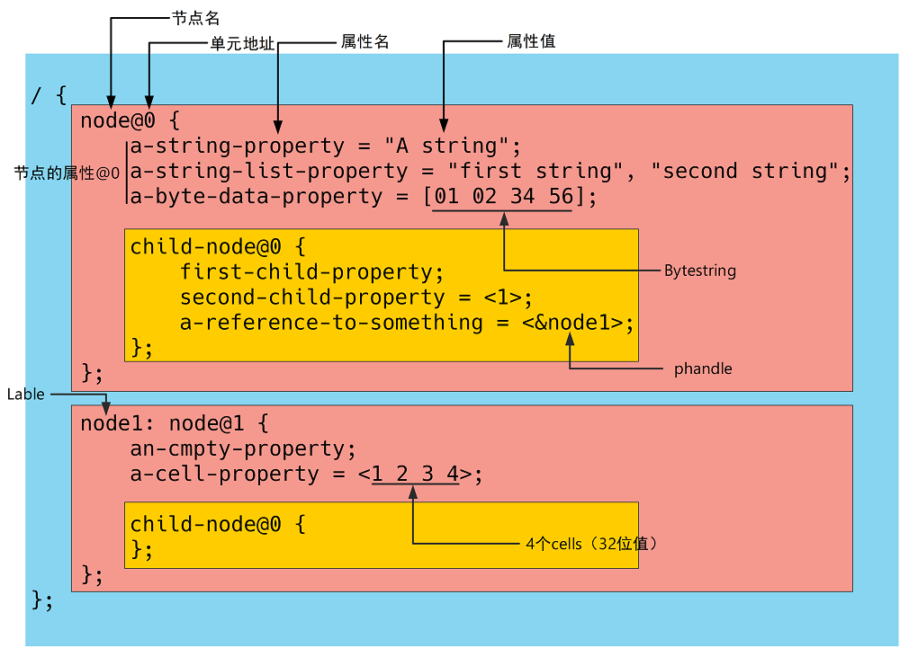
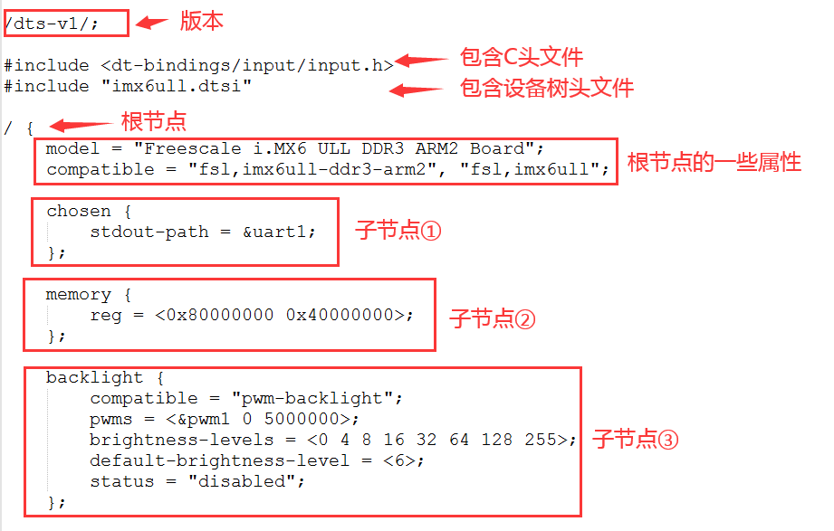
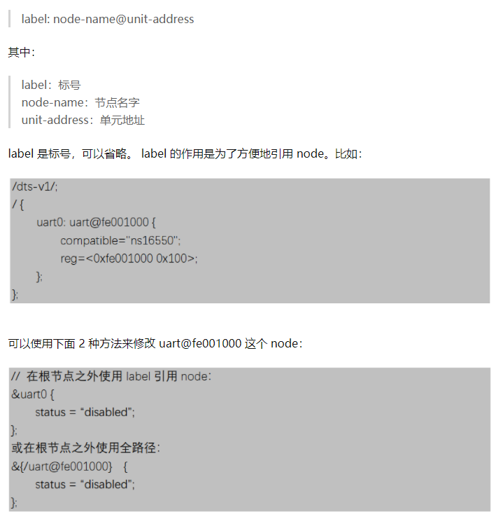
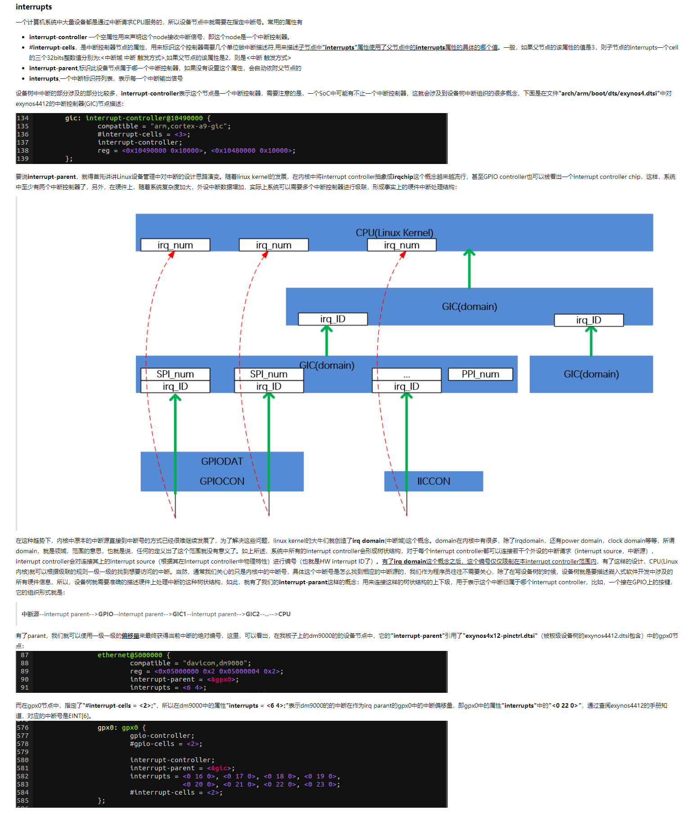
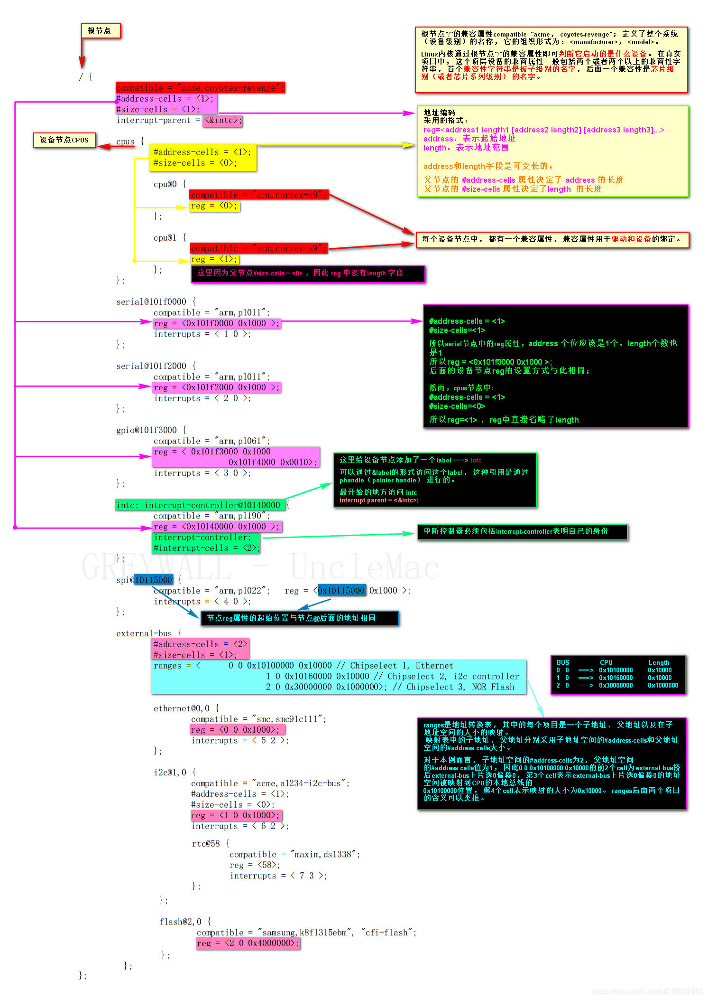

# 设备树详解

本文 续接 《【主线剧情03】NXP i.MX 系列 u-boot 移植基础详解》 一文中`移植过程`小节中有关设备树的内容。

编辑整理 By [Staok](https://github.com/Staok)，如有错误恭谢指出，侵删。CC-BY-NC-SA 4.0。

注意！本文适合学习设备树的一些基本概念和规则，和备查复习，但是要真正用上 设备树，要跟着系统性的学习 Linux驱动编程 来学习和练习！比如 百问网、正点原子 或 野火 等等。学习要跟着正儿八经编写的教材去系统性的学，不应该依靠网络搜索零碎的教程文章来学。

------

## 零 参考

工欲善其事，必先利其器。

比较全面的文章：

- [devicetree-org-devicetree-specification-github.com 官方语法描述](https://github.com/devicetree-org/devicetree-specification)；
- [Specifications - DeviceTree](https://www.devicetree.org/specifications/) 设备树组织官网发布的设备树标准；
- [Device Tree What It Is - eLinux.org](https://elinux.org/Device_Tree_What_It_Is) eLinux 网站的设备树介绍；
- [Device Tree Usage - eLinux.org](https://elinux.org/Device_Tree_Usage) eLinux 网站的设备树使用，循序渐进，推荐看；
- [设备树_To_run_away的博客-CSDN博客](https://blog.csdn.net/qq_16777851/category_8667602.html) 比较全面，共 30 篇文章；
- [韦东山嵌入式Linux设备树详解_ 免费试看 _哔哩哔哩_bilibili](https://www.bilibili.com/video/BV1Kt411p7Nn) 视频。
- [【第5篇】嵌入式Linux驱动开发基础知识_哔哩哔哩_bilibili](https://www.bilibili.com/video/BV14f4y1Q7ti?p=22)，简明设备树语法视频。

网友总结的零散文章：

- [Linux设备树语法详解 - Abnor - 博客园 (cnblogs.com)](https://www.cnblogs.com/xiaojiang1025/p/6131381.html)，部分细节介绍比较详细；
- [Linux 设备树详解 - 程序员大本营 (pianshen.com)](https://www.pianshen.com/article/428276673/)，该文介绍 Linux 内核解析 .dtb 文件，本文不涉及此内容；
- [【Linux笔记】设备树基础知识 - 知乎 (zhihu.com)](https://zhuanlan.zhihu.com/p/135280350)，[小白带你探索Linux设备树1_框架篇V1 - 知乎 (zhihu.com)](https://zhuanlan.zhihu.com/p/105730998)，部分细节介绍比较详细；
- [统一设备模型 - 蜗窝科技 (wowotech.net)](http://www.wowotech.net/sort/device_model)，很强但文章写不通顺，得读好几遍；
  - [Device Tree（一）：背景介绍 (wowotech.net)](http://www.wowotech.net/device_model/why-dt.html)；
  - [Device Tree（二）：基本概念 (wowotech.net)](http://www.wowotech.net/linux_kenrel/dt_basic_concept.html)；
  - [Device Tree（三）：代码分析 (wowotech.net)](http://www.wowotech.net/linux_kenrel/dt-code-analysis.html)，该文介绍 Linux 内核解析 .dtb 文件，本文不涉及此内容；
  - [Device Tree（四）：文件结构解析 (wowotech.net)](http://www.wowotech.net/device_model/dt-code-file-struct-parse.html)，设备树经过编译后的二进制文件的结构，以及 Linux 如何解析，本文不涉及此内容；
- [【Linux驱动开发】Linux设备树 - 程序员大本营 (pianshen.com)](https://www.pianshen.com/article/4511970596/)；
- [致驱动工程师的一封信 (wowotech.net)](http://www.wowotech.net/device_model/429.html)，扩展阅读；
- [u-boot FIT image介绍 (wowotech.net)](http://www.wowotech.net/u-boot/fit_image_overview.html)，扩展阅读；
- 【野火】《i.MX Linux开发实战指南》；
- 【正点原子】I.MX6U嵌入式Linux驱动开发指南。

本文部分内容引自上述链接。上述有些文章的描述不清等问题，本文形成时梳理了一下；有些文章中英文混写的问题，在引用的基础上简单的修一下格式，并补充中文说明。~~上述有些文章还会在结尾突然说“点到为止，不多讲”，嗯，你很强，同时我也可以理解为不会简练表达，或者吝惜自己宝贵的时间不愿多敲几个字~~，但是那篇中有一句话说得很对“我只是给你指条明路，剩下的就需要自己去走。最后说一句，代码不会骗你，还会告诉你别人不能告诉你的”。

又要批判一番了，总感觉概念一大堆：

- 为了描述编译行为，另造一套 Makefile 语法；（然后语法规则太绕了，又另设计 CMake 来生成 Makefile）
- 为了描述让命令行适应编程行为，另造一套 Shell 语法；
- 为了描述编译后的各个文件如何链接起来，另造一套链接文件 .lds 语法；
- 为了描述 SoC 上电自己初始化的行为，另造一套行为描述语法，比如 DCD 段；
- 为了描述 SoC 硬件外设，另造一套设备树语法，我觉得这语法和 json 差不多。等等等等。

为什么光另造规则，不多想一些可重用的方法；正如英文单词，数量已经超过 100 万个了，恨不得给宇宙中所有事物都单独取名？

也许原因之一是以上概念出现的很早，在那个混元初开的年代，还没有形成业内比较统一的、惯例的数据结构存储方法，所以百花齐放自造语法盛行。现在趋向于归一了，数据存储常用 json 或者 xml 语法，命令行编程常常趋近于兼容 shell 语法。挺好，越来越规范、归一，都这样的话不但提高来者的学习效率，也适合让机器去识别，早日实现全流程高度自动化。

------

## 一  记录

### 设备树基本概念

Device Tree 是一种 适合人类阅读的（或者叫适合有智能的生物阅读的） 描述 SoC 硬件外设的数据结构（以文本的形式），硬件的细节可以直接通过它传递给 Linux（Bootloader 会将这棵树传递给内核，然后内核可以识别这棵树），内核会将这些硬件资源和自己的相应的设备原型绑定，进而可以控制实际的硬件外设，实现 板级信息 和 内核 的分离；Device Tree 由一系列被命名的 结点（node）（结点本身可包含子结点，即 总分 的结构）和 属性（property）（成对出现的 name 和 value ）组成。

通常由 .dts 文件以文本方式对系统设备树进行描述，经过 Device Tree Compiler (dtc) 将 .dts 文件转换成二进制文件 binary device tree blob (dtb)，.dtb 文件可由 Linux 内核解析（ .dtb 文件是一种可以被 kernel 和 uboot 识别的二进制文件），Linux 解析后把设备节点信息存储在 device_node 结构体里面，然后与  Linux 内核中的设备原型结构体 platform_device 进行绑定，即注册设备信息，Linux 系统下的设备大多都是挂载在平台总线下的，所有的子节点将被作为设备注册到该设备总线上。

> 设备树只是用来给内核里的驱动程序，指定硬件的信息。比如LED驱动，在内核的驱动程序里去操作寄存器，但是操作哪一个引脚？这由设备树指定。

除了描述设备，还可以描述 IO 动作用于外设的必要初始化，例如一个设备树的节点设备的 IO 描述为如下：

```
device {
    rst-gpio = <&gpioc_ctl 10 OF_GPIO_ACTIVE_LOW>;
    irq-gpio = <&gpioc_ctl 11 0>;
    interrupts-extended = <&vic 11 IRQF_TRIGGER_RISING>;
};
```

然后在 Linux 内核或者 uboot 中会解析这个结构并根据其中的设定进行动作，如下示例解析和动作：

```c
int device_probe(struct platform_device *pdev)
{
    rst_gpio = of_get_named_gpio_flags(np, "rst-gpio", 0, &flags);
    if (flags & OF_GPIO_ACTIVE_LOW) {
        struct gpio_desc *desc;
 
        desc = gpio_to_desc(rst_gpio);
        set_bit(FLAG_ACTIVE_LOW, &desc->flags);
    }
 
    irq = of_irq_get(np, 0);
    trigger_type = irq_get_trigger_type(irq);
    request_threaded_irq(irq, NULL, irq_handler, trigger_type, "irq", NULL);
}
```

所以，如果修改中断触发类型或者电平有效状态只需要修改 .dts 文件，再编译重新装载即可。

有了device tree 就可以在不改动 Linux 内核的情况下，对不同的平台实现无差异的支持，只需更换相应的 .dts 文件即可，硬件有变动时不需要重新编译内核或驱动程序，只需要提供不一样的 .dtb 文件。

> Linux源码目录下scripts/dtc目录包含dtc工具的源码。在Linux的scripts/dtc目录下除了提供dtc工具外，也可以自己安装dtc工具，linux下执行：`sudo apt-get install device-tree-compiler` 安装dtc工具。其中还提供了一个fdtdump的工具，可以反编译dtb文件。

> 在描述Device Tree的结构之前，我们先问一个基础问题：是否Device Tree要描述系统中的所有硬件信息？答案是否定的。基本上，那些可以动态探测到的设备是不需要描述的，例如USB device。不过对于SOC上的usb host controller，它是无法动态识别的，需要在device tree中描述。同样的道理，在computer system中，PCI device可以被动态探测到，不需要在device tree中描述，但是PCI bridge如果不能被探测，那么就需要描述之。
>
> 我们可以将公共部分抽取出来，一般为一个系列的 SoC 共有的硬件外设，写成  `<SoC>.dtsi`（i 表示 include ），方便大家在 具体的板级的 .dts 文件中 include。这样每个 .dts 就只有自己差异的部分，公有的部分只需要 include 相应的 .dtsi 文件，这样就使整个设备树的管理更加有序。

在 Device Tree 中，可描述的信息包括（CPU、GPIO、时钟、中断、内存等）：

- CPU 的数量和类别；
- 内存基地址和大小；
- 总线和桥；
- 外设连接；
- 中断控制器和中断使用情况；
- GPIO 控制器和 GPIO 使用情况；
- Clock 控制器和 Clock 使用情况。

另外，设备树 一般能看懂 和进行简单修改即可，SoC 板子 的软硬件常常都是抄公板的（芯片公司发布的评估版的原理图和配套软件包（包括uboot、kernel和 rootfs 等等）），“天下板子一大抄”，因此自己做新板子的 软件的时候，比如要整一个适合自己板子的设备树，也是参考着公板的设备树整出来。

### 设备树基本语法

设备树 .dts 文件描述硬件的基本结构，在 .dts 文件中 一个 node 被定义成：

```
[label:] node-name[@unit-address] {
  [properties definitions]
  [child nodes]
}

方括号 [] 里面的为可选项
```

Device Tree 中的节点信息 示意图：



上图细说如下：

- device tree 的基本单元是 node。这些 node 被组织成树状结构，除了root node，每个 node 都只有一个 parent，即父级节点。一个 device tree 文件中只能有一个 root node，即根节点，必须是`/`。
- root 结点下面含一系列子结点，本例中为 "node@0" 和 "node@1" ；结点 "node@0" 下又含有一系列子结点，本例中为 "child-node@0"；
- 各结点都有一系列属性。属性（property）值标识了设备的特性，它的值（value）基本就下面四种：
  1. 可能是空，也就是没有值的定义。例如上图中的 `an-cmpty-property` ，这个属性没有赋值。
  2. 可能是一个一个的 u32 的整数数值，用尖括号表示（在 Device Tree 中一个 cell 就是一个 u32）。例如`#address-cells = <1>` 。当然，可能是一个数组。例如`<0x00000000 0x00000000 0x00000000 0x20000000>`，“#”是number的意思0。可以写成 10进制 或 16进制。
  3. 属性值是 16进制数，用方括号表示。例如 `binary-property = [0x01 0x23 0x45 0x67]`。其中`0x`可以省略，因为方括号就指明这是 16 进制数字。
  4. 可能是一个字符串，用双引号表示。例如`device_type = "memory"` ，当然也可能是一个 string list。例如`"PowerPC,970"`。
- 节点名字的格式是 `node-name@unit-address`，其中 node-name 就是设备名，最长可以是31个字符长度；unit_address 一般是设备地址，用来唯一标识一个节点；如果设备有 reg 属性，则 unit-address 就是寄存器地址，否则是用于区分的 编号。同级别的设备树下（相同级别的子节点）节点名唯一 。
- 可以通过 `&lable` 的形式访问一个带 lable 的 node，这种引用是通过 phandle（pointer handle）进行的。例如，上图中的 node1 就是一个 lable，node@0 的子节点 child-node@0 通过 `&node1` 引用 node@1 节点。经编译后，每一个 phandle 都是一个独一无二的整型值，在后续 kernel 中通过这个特殊的数字间接找到引用的节点。引用节点或者可用使用 full path（绝对路径），但一般不用，例如`/node-name-1/node-name-2/node-name-N`。

所以，一个设备树的基本框架可以写成下面这个样子。一般来说，`/`表示板子，它的子节点 node1 表示 SoC 上的某个 硬件外设/控制器，硬件外设/控制器 中的子节点 node2 表示挂接在这个控制器上的设备(们)。注释规则与 c 相同，用 `//...` 和 `/* ... */`。

```
/{                                  // 根节点  每个设备树文件都有一个根节点，每个设备都是一个节点
    node1{                          // node1 是节点名，是 / 的子节点
        key=value;                  // node1 的属性  每个设备的属性都用一组 key-value 对(键值对)来描述
                                    // 每个属性的描述用;结束
        ...
        node2{                      // node2 是 node1 的子节点 节点间可以嵌套，形成父子关系，这样就可以方便的描述设备间的关系
            key=value;              // node2 的属性
            ...
        }
    }                               // node1 的描述到此为止
    node3{
        key=value;
        ...
    }
}
```

Device Tree中的节点信息 实例图：



### 设备树常用节点

- 根节点，用 / 标识根节点；CPU节点，一般不需要我们设置，在 .dtsi 文件中都定义好了；

- aliases 节点的作用就是为其他节点起一个别名。以 `can0 = &flexcan1;` 为例。“flexcan1”是一个节点的名字，设置别名后我们可以使用“can0”来指代 flexcan1节点，与节点标签类似。  在驱动中如果要查找一个节点，通常情况下我们可以使用“节点路径”一步步找到节点。也可以使用别名“一步到位”找到节点。  

- memory 节点：芯片厂家不可能事先确定你的板子使用多大的内存，所以 memory 节点需要板厂设置，比如：

  ```
  memory {   
  	reg = <0x80000000 0x20000000>;   
  }; 
  ```

- chosen 节点：我们可以通过设备树文件给内核传入一些参数，例如下面在chosen节点中设置bootargs属性：

  ```
  chosen {   
      bootargs = "noinitrd root=/dev/mtdblock4 rw init=/linuxrc console=ttySAC0,115200";   
  };   
  ```

  这个节点用作 uboot 向 linux 内核传递配置参数的“通道”，我们在 Uboot 中设置的参数就是通过这个节点传递到内核的。

- 节点名、引用、修改和追加：



如果引用节点后编写的属性在之前已经有，则属性值会覆盖之前的，如果没有，则为追加属性。

### 设备树标准属性

> 引用 100ask 的教程。
>
> **#address-cells、#size-cells**
>
> cell指一个32位的数值。
>
> address-cells：address要用多少个32位数来表示；
>
> size-cells：size要用多少个32位数来表示。
>
> 比如一段内存，怎么描述它的起始地址和大小？下例中，address-cells为1，所以reg中用1个数来表示地址，即用0x80000000来表示地址；size-cells为1，所以reg中用1个数来表示大小，即用0x20000000表示大小：
>
> ```
> / {
>     #address-cells = <1>;
>     #size-cells = <1>;
>     memory {
>     reg = <0x80000000 0x20000000>;
>         };
> };
> ```
>
> **compatible**
>
> “compatible”表示“兼容”，对于某个LED，内核中可能有A、B、C三个驱动都支持它，那可以这样写：
>
> ```
> led {
> 	compatible = “A”, “B”, “C”;
> };
> ```
>
> 内核启动时，就会为这个LED按这样的优先顺序为它找到驱动程序：A、B、C。
>
> 根节点下也有compatible属性，用来选择哪一个“machine desc”：一个内核可以支持machine A，也支持machine B，内核启动后会根据根节点的compatible属性找到对应的machine desc结构体，执行其中的初始化函数。
>
> compatible的值，建议取这样的形式："manufacturer,model"，即“厂家名,模块名”。
>
> **model**
>
> model属性与compatible属性有些类似，但是有差别。
>
> compatible属性是一个字符串列表，表示可以你的硬件兼容A、B、C等驱动；
>
> model用来准确地定义这个硬件是什么。
>
> 比如根节点中可以这样写：
>
> ```
> / {
>   compatible = "samsung,smdk2440", "samsung,mini2440";
>   model = "jz2440_v3";
> };
> ```
>
> 它表示这个单板，可以兼容内核中的“smdk2440”，也兼容“mini2440”。
>
> 从compatible属性中可以知道它兼容哪些板，但是它到底是什么板？用model属性来明确。
>
> **status**
>
> dtsi文件中定义了很多设备，但是在你的板子上某些设备是没有的。这时你可以给这个设备节点添加一个status属性，设置为“disabled”：
>
> ```
> &uart1 {
>    status = "disabled";
> };
> ```
>
> 用到时使用 "okay"。
>
> **reg**
>
> reg的本意是register，用来表示寄存器地址。
>
> 但是在设备树里，它可以用来描述一段空间。反正对于ARM系统，寄存器和内存是统一编址的，即访问寄存器时用某块地址，访问内存时用某块地址，在访问方法上没有区别。
>
> reg属性的值，是一系列的“address size”，用多少个32位的数来表示address和size，由其父节点的#address-cells、#size-cells决定。
>
> 示例：
>
> ```
> /dts-v1/;
> / {
>     #address-cells = <1>;
>     #size-cells = <1>; 
>     memory {
>     	reg = <0x80000000 0x20000000>;
>     };
> };
> ```
>
> **name** (过时了，建议不用)
>
> 它的值是字符串，用来表示节点的名字。在跟platform_driver匹配时，优先级最低。
>
> compatible属性在匹配过程中，优先级最高。
>
> **device_type** (过时了，建议不用)
>
> 它的值是字符串，用来表示节点的类型。在跟platform_driver匹配时，优先级为中。
>
> compatible属性在匹配过程中，优先级最高。

> 标准属性。在设备树中，有一些特定的属性。Linux 设备树语法中定义了一些具有规范意义的属性，包括：compatible, address, interrupt 等，这些信息能够在内核初始化找到节点的时候，自动解析生成相应的设备信息。此外，还有一些Linux内核定义好的，一类设备通用的有默认意义的属性，这些属性一般不能被内核自动解析生成相应的设备信息，但是内核已经编写的相应的解析提取函数，常见的有 "mac_addr"，"gpio"，"clock"，"power"。"regulator" 等等。
>
> - **compatible**：Linux 驱动中可以通过设备节点中的 "compatible" 这个属性查找设备节点，即根据这个属性的字符串描述的芯片的公司和驱动文件的字符串**索引到驱动文件**。例如系统初始化时会初始化 platform 总线上的设备时，根据设备节点”compatible”属性和驱动中 of_match_table 对应的值，匹配了就加载对应的驱动。  比如 `compatible = "fsl,imx6ull";` 就是找 飞思卡尔 公司 的名为 imx6ull 的板子的相关东西，一般是先放公司名再放板子名。
>
> - **address**：
>
>   - #address-cells，用来描述子节点的"reg"属性的地址表中用来描述首地址的cell的数量；
>   - #size-cells，      用来描述子节点的"reg"属性的地址表中用来描述地址长度的cell的数量。
>
>   若 reg 中的数值数量多于以上两个属性值的和，那么reg 属性里的数据是“地址”、“长度”交替的。
>
>   有了这两个属性，子节点中的 "reg" 就可以描述一块连续的地址区域。下例中，父节点中指定了`#address-cells = <2>;#size-cells = <1>;`，则子节点 dev-bootscs 中的 reg 中的前两个数表示一个地址，即 MBUS_ID(0xf0, 0x01) 和 0x1045C，然后有一个数表示从首地址开始要访问到的寄存器的长度，即 0x4 ，单位为 cell。
>
>   ```
>   soc {
>       #address-cel1s = <2>;
>       #size-cells = <1>; 
>       controller = <&mbusc>; 
>   
>       devbus_bootcs:devbus-bootcs {
>           compatible = "marvell,orion-devbus"; 
>           reg = <MBUS_ID(OxfO,0x01) 0X1046C 0x4>; 
>           ranges = <0 MBUS_ID(0x01,0x0f) 0 Oxffffffff>;
>           #address-cells = <1>;
>           #size-cells = <1>; 
>           clocks = <&core_clk 0>; 
>           status = "disabled";
>       };
>       ...
>   };
>   ```
>
> - gpio：gpio也是最常见的IO口，常用的属性有
>
>   - "gpio-controller"，用来说明该节点描述的是一个gpio控制器；
>   - "#gpio-cells"，用来描述gpio使用节点的属性一个cell的内容；
>   - 描述 IO 行为，IO名 = <&引用GPIO节点别名 GPIO标号 工作模式>。
>
> - interrupts：引自[Linux设备树语法详解 - Abnor - 博客园 (cnblogs.com)](https://www.cnblogs.com/xiaojiang1025/p/6131381.html)。
>
> - 

> |              标准属性               |                             描述                             |
> | :---------------------------------: | :----------------------------------------------------------: |
> |         **compatible** 属性         | compatible 属性也叫做“兼容性”属性。用于将设备和驱动绑定起来。值是一个字符串列表，用于选择设备所要使用的驱动程序。 |
> |           **model** 属性            | 值是字符串，一般描述设备模块信息，例如名字。相比较于 compatible，用来更准确的说明这个硬件是什么。 |
> |           **status** 属性           | 值是字符串，设备的状态信息。经常使用 "okay" 和 "disabled"。  |
> | **#address-cells #size-cells** 属性 | 值是无符号 32 位整形。可以用在任何拥有子节点的设备中，用于描述子节点的地址信息。#address-cells 属性值决定了子节点 reg 属性中地址信息所占用的字长(32 位)，#size-cells 属性值决定了子节点 reg 属性中长度信息所占的字长(32 位)。 |
> |            **reg** 属性             | 值一般是(address，length)对。用于描述设备地址空间资源信息，一般都是某个外设的寄存器地址范围信息 |
> |             ranges 属性             | ranges 是一个地址映射/转换表，ranges 属性每个项目由子地址、父地址和地址空间长度 这三部分组成。如果 ranges 属性值为空值，说明子地址空间和父地址空间完全相同，不需要进行地址转换。该属性提供了子节点地址空间和父地址空间的映射（转换）方法，常见格式是 `ranges = < 子地址, 父地址, 转<br/>换长度 >`。  比如对于 #address-cells 和 #size-cells 都为 1 的话，以 `ranges=<0x0 0x10 0x20>` 为例，表示将子地址的从 0x0~(0x0+ 0x20) 的地址空间映射到父地址的 0x10~(0x10 + 0x20)。 |
> |            ~~name 属性~~            | ~~值是字符串，name 属性用于记录节点名字。name 属性已经被弃用，不推荐使用 name 属性，一些老的设备树文件可能会使用此属性。~~ |
> |        ~~device_type 属性~~         | ~~值是字符串，IEEE 1275 会用到此属性，用于描述设备的 FCode，但是设 备树没有 FCode，所以此属性也被抛弃了。此属性只能用于 cpu 节点或者 memory 节点。~~ |

### 设备树加深理解

看这里加深一下理解，Device Tree 中的节点信息 实例图：引自[ Linux dts 设备树详解(二) 动手编写设备树dts_GREYWALL-CSDN博客_设备树编写](https://blog.csdn.net/u010632165/article/details/91488811)。



------

## 二 其他

### Uboot 中有关 dtb 的内容

- [uboot\] （番外篇）uboot之fdt介绍_ooonebook的博客-CSDN博客](https://blog.csdn.net/ooonebook/article/details/53206623)；
- [uboot 使用fdt命令查看设备树_兔兔里个花兔的博客-CSDN博客](https://blog.csdn.net/qq_28637193/article/details/88526871)；
- [u-boot中fdt命令的使用_voice_shen的专栏-CSDN博客_fdt命令](https://blog.csdn.net/voice_shen/article/details/7441894)；
- [uboot处理dtb - zongzi10010 - 博客园 (cnblogs.com)](https://www.cnblogs.com/zongzi10010/p/10793084.html)；

一下有关 linxu 的小节会在以后放到`【07-08】 linux 驱动/应用` 的文章里面。

### Linux 中设备树操作函数

Linux 内核给我们提供了一系列的函数来获取设备树中的节点或者属性信息，这一系列的函数都有一个统一的前缀“of_”（“open firmware”即开放固件。 ），所以在很多资料里面也被叫做 OF 函数。

device_node 结构体，它保存着设备节点的信息  其内容简述：

- name： 节点中属性为 name 的值；
- type： 节点中属性为 device_type 的值；
- full_name： 节点的名字，在 device_node 结构体后面放一个字符串， full_name 指向它；
- properties： 链表，连接该节点的所有属性；
- parent： 指向父节点；
- child： 指向子节点；
- sibling： 指向兄弟节点。

得到 device_node 结构体之后我们就可以使用其他 of 函数获取节点的详细信息。

of 函数更多内容可参：（网上很多，以后用的时候整理补充在这里）

- [【Linux笔记】设备树基础知识 - 知乎 (zhihu.com)](https://zhuanlan.zhihu.com/p/135280350)。
- 【野火】《i.MX Linux开发实战指南》的 `103.3 如何获取设备树节点信息` 一节，讲了节点寻找、属性值获取和内存映射三大块 API。

### 用设备树建立和控制设备实例

- 从设备树拿信息控制 IO 和 使用 platform_device 控制 IO 的介绍和对比：[【Linux笔记】设备树实例分析 - 知乎 (zhihu.com)](https://zhuanlan.zhihu.com/p/135281623)。
- [linux 驱动开发之平台设备驱动设备树 led字符驱动的开发(详细注释)_myz348的博客-CSDN博客](https://blog.csdn.net/myz348/article/details/104911153)。
- 【野火】《i.MX Linux开发实战指南》的`103.4 向设备树中添加设备节点实验`一节。
- 【野火】《i.MX Linux开发实战指南》的 104 章节 `使用设备树实现 RGB 灯驱动`。
- 【野火】《i.MX Linux开发实战指南》的 105 章节 `使用设备树插件实现 RGB 灯驱动`。
- [【第5篇】嵌入式Linux驱动开发基础知识_哔哩哔哩_bilibili](https://www.bilibili.com/video/BV14f4y1Q7ti?p=24)，在驱动程序中读取设备树资源。

