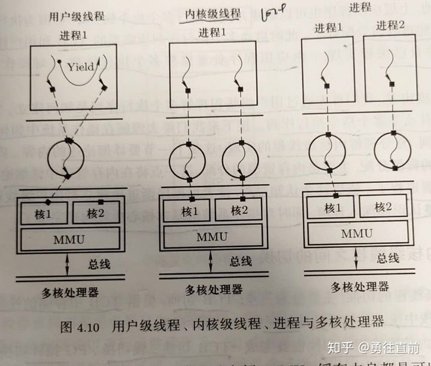

# 进程和线程的分配 娓娓道来

主要参考 [用户态线程和内核态线程的区别 - 拾月凄辰 - 博客园 (cnblogs.com)](https://www.cnblogs.com/FengZeng666/p/14219477.html)，[linux：线程的3种实现方式（内核级，用户级和混合型） - 简书 (jianshu.com)](https://www.jianshu.com/p/0dc3c5023ec7)。

过于基础的概念不会在此提及。

以下是针对 单 CPU 多核心来说，如果指多个CPU，那么假设你指的是开放式内存架构，多计算机集群，那么用 MPI 库 或者 OpenMP 讯息传递接口开发最好了。

------

一图展示 用户态线程、内核态线程 和 进程 的调度。

## 用户级线程

用户级线程（User-Level Threads，ULT），即这些线程由进程自身负责调度和管理，在用户空间实现多个线程，操作系统不知道这些线程的存在。

对同一个进程内的线程为并发执行，即轮询，由线程库 pthread 来实现。内核感知不到用户级的多线程的存在，内核继续以进程为调度单位；这些用户级线程只能占用一个核，所以做不到并行，并且有一个用户级线程阻塞，对于操作系统就是其所在的进程阻塞了（连带着它的进程的所有线程都阻塞了）。

- 用户空间运行线程库，任何应用程序都可以通过使用线程库被设计成多线程程序。线程库是用于用户级线程管理的一个例程包，它提供多线程应用程序的开发和运行支撑环境，包含：用于创建和销毁线程的代码、在线程间传递数据和消息的代码、调度线程执行的代码以及保存和恢复线程上下文的代码。
- 所以线程的创建，消息传递，调度，保存/恢复上下文都有线程库来完成。内核感知不到多线程的存在。内核继续以进程为调度单位，并且给该进程指定一个执行状态（就绪、运行、阻塞等）。

纯用户级线程的特点：

> 优点：
>
> 1. 线程切换不需要内核模式，能节省模式切换开销和内核资源。
> 2. 允许进程按照特定的需要选择不同的调度算法来调度线程。调度算法可自己实现。
> 3. 由于其不需要内核进行支持，所以可以跨OS运行（脱离操作系统运行，即裸机运行，是这个意思吧？）。
>
> 缺点：
>
> 1. 不能利用多核处理器的优势，OS调度进程，每个进程的同一时刻仅有一个ULT能执行。
> 2. 一个ULT阻塞，将导致整个进程的阻塞。

jacketing技术可以解决ULT一个线程阻塞导致整个进程阻塞。

> jacketing的目标是把一个产生阻塞的系统调用转化成一个非阻塞的系统调用。例如，当进程中的一个线程调用IO中断，先调用一个应用级的I/O jacket例程，而不是直接调用一个系统I/O。让这个jacket例程检查并确定I/O设备是否忙。如果忙，则jacketing将控制权交给该进程的线程调度程序，决定该线程进入阻塞状态并将控制权传送给另一个线程（若无就绪态线程咋可能执行进程切换）。

 

## 内核级线程

内核级线程（Kernel-Level Threads，KLT），也有叫做内核支持的线程。进程的每个线程都对应一个操作系统线程，由操作系统负责管理和调度这些线程。对多个线程并行执行，即利用多核。但是缺点，内核级线程切换的代价要比用户级线程大，内核级线程的数量是有限的，扩展性比不上用户级线程。

- 线程管理的所有工作（创建和撤销）由操作系统内核完成。
- 操作系统内核提供一个应用程序设计接口API，供开发者使用KLT。

纯内核级线程特点：

> 优点：
>
> 1. 进程中的一个线程被阻塞，内核能调度同一进程的其他线程（就绪态）占有处理器运行。
> 2. 多处理器环境中，内核能同时调度同一进程的多线程，将这些线程映射到不同的处理器核心上，提高进程的执行效率（这样可以实现并行）。
>
> 缺点：
>
> 1. 应用程序的内核级线程线程在用户态运行，线程调度和管理在OS内核实现。线程调度时，控制权从一个线程改变到另一线程，需要模式切换，系统开销较大。

可以看出，用户级线程和内核级线程都有各自的优点和缺点，在应用上主要表现为：

- 用户级多线程对于处理逻辑并行性问题有很好的效果。不擅长于解决物理并行问题。
- 内核级多线程适用于解决物理并行性问题。

## 线程规划的模型

由操作系统内核支持内核级多线程，由操作系统的程序库来支持用户级多线程（用户级线程创建完全在用户空间创建，调度也在应用程序内部进行，然后把用户级多线程映射到（或者说是绑定到）一些（一些还是一个？）内核级多线程）。**编程人员可以针对不同的应用特点调节内核级线程的数目来达到物理并行性和逻辑并行性的最佳方案。**

### 多对一（Many to One）

用户态进程中的多线程复用一个内核态线程。这样，极大地减少了创建内核态线程的成本，但是用户级线程不可以并行。因此，这种模型现在基本上用的很少。

用户态线程怎么用内核态线程执行程序？程序是存储在内存中的指令，用户态线程是可以准备好程序让内核态线程执行的。

### 一对一（One to One）

该模型为每个用户态的线程分配一个单独的内核态线程，在这种情况下，每个用户态都需要通过系统调用创建一个绑定的内核线程，并附加在上面执行。 这种模型允许所有线程并行执行，能够充分利用多核优势，Windows NT 内核采取的就是这种模型。但是因为线程较多，对内核调度的压力会明显增加。

### 多对多（Many To Many）

这种模式下会为 n 个用户态线程分配 m 个内核态线程。m 通常可以小于 n。一种可行的策略是将 m 设置为核数。这种多对多的关系，减少了内核线程，同时也保证了多核心并行。Linux 目前采用的就是该模型。

### 两层设计（Two Level）

这种模型混合了多对多和一对一的特点。多数用户态线程和内核线程是 n 对 m 的关系，少量用户线程可以指定成 1 对 1 的关系。

## 思考

### 启发任务分配的规则

*p.s 参考 [多线程，多进程，多核总结 - 知乎 (zhihu.com)](https://zhuanlan.zhihu.com/p/82123111)，[gil基本介绍 - 风-fmgao - 博客园 (cnblogs.com)](https://www.cnblogs.com/fmgao-technology/p/9194614.html)。*

任务可以分为 计算密集型 和 IO密集型 。假设我们现在使用一个进程来完成这个任务：

基本原则：**计算密集多进程，IO密集多线程**（因为GIL的存在，所以IO密集反而合适多线程）；**一个进程处理一对输入输出以及之间的计算（可以理解为一个大任务，系统级的），一个进程内的一堆线程处理该进程内的多个计算路线。**

- 对计算密集型任务，可以使用【核心数】个进程（或内核级线程？）（比如4核就是做一个进程带4个内核级线程 或者 四个进程各带一个线程），就可以占满cpu资源，进而可以充分利用cpu，如果再多，就会造成额外的开销。
- 对于IO密集型任务（涉及到网络、磁盘IO的任务都是IO密集型任务），即经常被阻塞，用 一个进程内的 多个线程 对应的 跑多个 IO设备。

实现并行计算有三种方式，单进程多内核级线程，多进程（每个进程只有默认的一个线程），多进程+多线程。如果是多进程，因为每个进程资源是独立的（地址空间和数据空间），就要在操作系统层面进行通信，如管道，队列，信号等；多内核线程的话会共享进程中的地址空间和数据空间，一个线程的数据可以直接提供给其他线程使用，但方便的同时会造成变量值的混乱，所以要通过线程锁来限制线程的执行。

有时候多个任务的执行有先后顺序，可以使用进程间通讯或者线程间通讯的机制比如信号量、锁机制等等。在安全与效率之间，首先考虑的是安全。

### 疑问

- 当只有一个应用进程时候，CPU有四核，那么有意识的最多创建四个内核级线程可以充分利用CPU？
- 如果要多个应用进程，那么每个进程如何分配线程，几个应用级线程？几个内核级线程？

### 可分配情况的列举

在 CPU 为 4 核心的情况下。

1. 应用分为 4 个进程，每个进程中有  n 个用户级线程；特点：基本“任务”可以分配的很多，有 4 x n 个，但形式单一。
2. 应用分为 1 个进程，里面包含 4 个内核级线程；特点：基本“任务”只能分 4 个，且形式单一。
3. 应用分为 2 个进程 A 和 B，其中 A 进程包含 n 个 用户级线程，B 进程包含 3 个内核级线程；特点：形式多，根据应用中 计算密集 和 IO密集 来布置，那么就是 A 负责 IO密集的任务，B 负责 计算密集的任务。
4. 应用分为 3 个进程 A、B 和 C， A 和 B 进程包含 n 个用户级线程，C 进程包含 2 个内核级线程；特点同上。

## 进程 和 线程 设计经验参考

*p.s 这里面的内容可以梳理出来写在这里。*

- [嵌入式为什么没有软件架构师？ - 知乎 (zhihu.com)](https://zhuanlan.zhihu.com/p/430120238)。
- [C 语言线程间怎么通信？ - 知乎 (zhihu.com)](https://www.zhihu.com/question/517999009/answer/2384540386)。