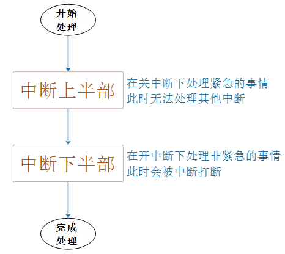

# 基本字符设备驱动程序获取数据的说明

引 100ask，侵删。

------

## 概念

应用程序 APP 的读取驱动程序的四种基本方式：阻塞、非阻塞、poll 和 异步通知（注册SIGIO信号回调函数。信号之于应用程序，相当于中断之于驱动程序）。这部分详见 `【Linux 应用开发】\1-文件io读写的基本四种机制` 里的介绍和例子。

相应的 驱动程序 也类似的提供这四种基本的 读取和上报应用程序的 编写模式。

因此驱动程序支持这四种的哪一种方式或多种，应用程序才能使用哪一种或多种方式进行数据获取，应用程序的写法是与驱动程序所提供的功能紧密相关的。

> **驱动程序提供能力，不提供策略**
>
> 我们的驱动程序可以实现下述4种提供按键的方法，但是驱动程序不应该限制APP使用哪种方法。
>
> 这就是驱动设计的一个原理：提供能力，不提供策略。**就是说，你想用哪种方法都行，驱动程序都可以提供；但是驱动程序不能限制你使用哪种方法**。

> **查询**（相当于应用程序的 **非阻塞方式**获取）：
>
> 驱动程序中构造、注册一个file_operations结构体，里面提供有对应的open,read函数。APP调用open时，导致驱动中对应的open函数被调用，在里面配置GPIO为输入引脚。APP调用read时，导致驱动中对应的read函数被调用，它读取寄存器，把引脚状态直接返回给APP。
>
> **休眠-中断**（相当于应用程序的 **阻塞方式**获取）：
>
> - 驱动程序中构造、注册一个file_operations结构体，里面提供有对应的open,read函数。
> - APP调用open时，导致驱动中对应的open函数被调用，在里面配置GPIO为输入引脚；并且注册GPIO的中断处理函数。
> - APP调用read时，导致驱动中对应的read函数被调用，如果有按键数据则直接返回给APP；否则APP在内核态休眠。
> - 当用户按下按键时，GPIO中断被触发，导致驱动程序之前注册的中断服务程序被执行。它会记录按键数据，并唤醒休眠中的APP。
> - APP被唤醒后继续在内核态运行，即继续执行驱动代码，把按键数据返回给APP(的用户空间)。
>
> **poll 方式**（相当于应用程序的 poll方式获取）：
>
> - 上面的休眠-唤醒方式有个缺点：如果用户一直没操作按键，那么APP就会永远休眠。
> - 我们可以给APP加个等待超时时间，这就是poll方式。
> - 驱动程序中构造、注册一个file_operations结构体，里面提供有对应的open,read,poll函数。
> - APP调用open时，导致驱动中对应的open函数被调用，在里面配置GPIO为输入引脚；并且注册GPIO的中断处理函数。
> - APP调用poll或select函数，意图是“查询”是否有数据，这2个函数都可以指定一个超时时间，即在这段时间内没有数据的话就返回错误。这会导致驱动中对应的poll函数被调用，如果有按键数据则直接返回给APP；否则APP在内核态休眠一段时间。
> - 当用户按下按键时，GPIO中断被触发，导致驱动程序之前注册的中断服务程序被执行。它会记录按键数据，并唤醒休眠中的APP。
> - 如果用户没按下按键，但是超时时间到了，内核也会唤醒APP。
> - 所以APP被唤醒有2种原因：用户操作了按键，超时。被唤醒的APP在内核态继续运行，即继续执行驱动代码，把“状态”返回给APP(的用户空间)。
> - APP得到poll/select函数的返回结果后，如果确认是有数据的，则再调用read函数，这会导致驱动中的read函数被调用，这时驱动程序中含有数据，会直接返回数据。
>
> **异步通知 方式**（相当于应用程序的 异步通知方式获取）：
>
> - 异步通知的实现原理是：内核给APP发信号。信号有很多种，这里发的是SIGIO。
> - 驱动程序中构造、注册一个file_operations结构体，里面提供有对应的open,read,fasync函数。
> - APP调用open时，导致驱动中对应的open函数被调用，在里面配置GPIO为输入引脚；并且注册GPIO的中断处理函数。
> - APP给信号SIGIO注册自己的处理函数：my_signal_fun。
> - APP调用fcntl函数，把驱动程序的flag改为FASYNC，这会导致驱动程序的fasync函数被调用，它只是简单记录进程PID。
> - 当用户按下按键时，GPIO中断被触发，导致驱动程序之前注册的中断服务程序被执行。它会记录按键数据，然后给进程PID发送SIGIO信号。
> - APP收到信号后会被打断，先执行信号处理函数：在信号处理函数中可以去调用read函数读取按键值。信号处理函数返回后，APP会继续执行原先被打断的代码。
>
> 应用程序注册信号回调函数的例子见：`【Linux 应用开发】\1-文件io读写的基本四种机制\例程-来自百问网\05_input_read_fasync.c`。
>
> 关于 信号（signal）详解可见 [（真正全）Linux进程和线程的基本编程、通讯和例程【杂记】_Real-Staok的博客-CSDN博客](https://blog.csdn.net/Staokgo/article/details/124169573) 里的 `信号（Signal）`一节。

> **在 shell 中给进程发信号**：
>
> 假定应用程序叫 signal。
>
> ```shell
> ./signal &                    // 后台运行
> ps  -A | grep signal          // 查看进程ID，假设是 9527
> kill  -SIGIO  9527            // 给这个进程发名为 SIGIO 的信号
> ```

## 例子

### 查询方式-非阻塞

本节的源码路径：`查询方式-非阻塞\`。

> 我们的目的写出一个容易扩展到各种芯片、各种板子的按键驱动程序，所以驱动程序分为上下两层：
>
> ① button_drv.c分配/设置/注册file_operations结构体
>
> 起承上启下的作用，向上提供button_open,button_read供APP调用。
>
> 而这2个函数又会调用底层硬件提供的p_button_opr中的init、read函数操作硬件。
>
> ② board_xxx.c分配/设置/注册button_operations结构体
>
> 这个结构体是我们自己抽象出来的，里面定义单板xxx的按键操作函数。
>
> 这样的结构易于扩展，对于不同的单板，只需要替换board_xxx.c提供自己的button_operations结构体即可。

这里的程序结构与 `【Linux 驱动开发】\基本字符设备驱动程序-输出\进化1_外设操作和驱动程序分离` 和 `【Linux 驱动开发】\基本字符设备驱动程序-输出\进化2_支持多种板子` 一致，都是驱动程序单独出来，外设资源和外设操作 都放在另一个文件里面，外设操作（如初始化、读、写等）的 函数API 都打包放进 一个结构体 struct button_operations，然后 驱动程序 调用这个结构体里面的操作函数来操作硬件即可。

两个文件分别编译为两个模块，先加载驱动程序的模块，再才能加载 外设操作程序的模块。外设操作程序的模块在被加载的时候 才会调用 创建设备 device_create，该模块卸载时候 再删除设备 device_destroy。

应用程序 open 时候 不传入 NOBLOCK 标志（因此驱动程序写的时候应该保证 不要有任何阻塞的语句），应用程序 read 的时候，驱动程序直接返回结果。

模块装载完毕之后，进行测试 01_button_drv_template：

```c
ls /dev/100ask_button* -l            // 查看设备节点
    返回：
    crw-------    1 root     root      236,   0 Jan 18 08:57 /dev/100ask_button0
    crw-------    1 root     root      236,   1 Jan 18 08:57 /dev/100ask_button1

./button_test /dev/100ask_button0    // 读按键
    返回：
    [450.886180] /home/book/source/04_button_drv/01_button_drv_template/board_xxx.c board_xxx_button_init_gpio 28, init gpio for button 0
    [450.910915] /home/book/source/04_button_drv/01_button_drv_template/board_xxx.c board_xxx_button_read_gpio 33, read gpio for button 0
    get button : 1                  // 得到数据
```

参考 100ask 的 04_button_drv。

### GPIO、Pinctrl 子系统的使用

本节的源码路径：`gpio_and_pinctrl\`。

教程 可看 `100ask对gpio和pinctrl子系统简明介绍.docx` 或 视频 [Pinctrl子系统重要概念-【第5篇】嵌入式Linux驱动开发基础知识_哔哩哔哩_bilibili](https://www.bilibili.com/video/BV14f4y1Q7ti?p=32) 以及这个视频后面的几个视频连着看。

例子 `【Linux 驱动开发】\基本字符设备驱动程序-输入\gpio_and_pinctrl`，引自 100ask 05_gpio_and_pinctrl。

（后面的几段话是理解之后的描述，没学应该先去看教程）

后面的例子使用到 GPIO、Pinctrl 子系统。GPIO、Pinctrl 子系统 即 按照一定规则编写设备树的某些节点的属性和值，然后内核提供一些专用的 API 在驱动程序中来读取这些节点的属性，进而来方便的设置 IO 的 方向、值 等等。Pinctrl 用于引脚配置（配置为 GPIO 还是 复用为 I2C 等其它外设的引脚），GPIO 子系统就用于标记出要使用哪些 IO 、配置引脚方向 和 把引脚配置为输入、输出等简单的功能（供驱动程序获取），注意：一个是相当于设置 IO 的 IOMUX，另一个是 使用 IO，要用到某一个 IO 时候这两处都要在设备树中设置一下。当驱动 drive 与 设备树 中的 设备节点 匹配之后，会自动根据里面的值去配置 IO，包括 default 状态和 sleep 状态，是内核自动完成的。

实现的效果就是：修改设备树，驱动里面调用 gpiod_xxx() 等相关的 API 来获取该 GPIO 并控制其 方向、值 等等，就这样。

> 要操作GPIO引脚，先把所用引脚配置为GPIO功能，这通过Pinctrl子系统来实现。
>
> 然后就可以根据设置引脚方向(输入还是输出)、读值──获得电平状态，写值──输出高低电平。
>
> 以前我们通过寄存器来操作GPIO引脚，即使LED驱动程序，对于不同的板子它的代码也完全不同。
>
> 当BSP工程师实现了GPIO子系统后，我们就可以：
>
> a. 在设备树里指定GPIO引脚
>
> b. 在驱动代码中：
>
> 使用GPIO子系统的标准函数获得GPIO、设置GPIO方向、读取/设置GPIO值。
>
> 这样的驱动代码，将是单板无关的。

对于使用来讲：对于 Pinctrl 子系统，是在 设备树中相应的 子节点下 要先有 pinctrl 的子节点，在里面写好各个 IO 配置为某个功能（①这个一般芯片厂家会提供，看看 公板/评估板 的 BSP 里面的 设备树，这个里面的 pinctrl 子节点 是 BSP工程师写好提供的，②会有工具软件来生成（如 imx 的 `Pins_Tool_for_i.MX...`工具），主要用于用户自己用到一些 IO，③如果没有生成工具就自己参考着来了，参考提供的文档或设备树源码），然后在自己的板子的设备树中去定义自己这个设备的节点（如果是用户自定IO，即 设备树里面没有要用的 pinctrl 的子节点，那么就按照前面 的方法来自己加上），在里面调用前面的 pinctrl 的子节点来设置板子上的 IO 功能，即设置 `pinctrl-name = "default", "sleep", ...; pinctrl-0 = <&...>;` 等这类属性。对于 GPIO 子系统，即在自己板子的设备树的该节点（自己这个设备的节点） 里 继续写 `xxx_gpios = <&... ... GPIO_ACTIVE_HIGH/LOW>;`等这种属性，驱动在与设备匹配（通过 compatible 属性等）之后 自动解析这些设备树节点和属性 并据此 配置指定的 IO，然后驱动可以调用 gpiod_xxx() 等相关的 API 来控制 IO 的 方向、值 等等。

一个设备树中方使用 GPIO、Pinctrl 的例子：


对上图说明：其中在 自己板子的设备树的 最外层 定义一个 IO 的节点（左边），`pinctrl-0` 引用 生成的 IO MUX 配置信息节点（右上），然后在左边可以直接继续写 `xxx_gpios = <&... ... GPIO_ACTIVE_HIGH/LOW>;` 或者再定义一个子节点然后在里面写。然后就可以在驱动程序中的 probe 函数中 获取 该 IO、配置方向 和 读写了。还要确定该引脚没有其它节点使用，直接搜索  `xxx_gpios = <&... ... GPIO_ACTIVE_HIGH/LOW>;` 的 < > 里面的内容找到其它用到 该 GPIO 的节点，然后可以在其中添加 `status = "disabled";` 即可将其禁用。注意这个例子是 imx6ull 的，不同 SoC 设备树的写法会有变化，多变通。

**引入 这两个子系统后，对于板子的区分 就依靠 设备树，驱动程序里面可以根据设备树里面指定的资源来编写 外设操作相关的程序，如果驱动程序编写的好，那么更换板子的时候驱动程序几乎不用更改，只修改设备树，那么这就是做的很漂亮、很优雅的活儿。**

参考 100ask 的 05_gpio_and_pinctrl。

### 中断方式-阻塞

现在新出的 ARM SoC 都使用 中断控制器 (Generic Interrupt Controller，GIC) 来管理所有外设的中断信号，当有一个或一些外设向 CPU 发出中断信号时 GIC根据其优先级选出一路中断信号 送达 CPU，然后 CPU 跳转到 异常向量表中的 中断处理函数（这些都是硬件完成的），然后进行现场保护、跳转到处理函数，从中断中退出后 进行现场恢复（这些都是软件完成的）。关于 ARM SoC 处理器架构、启动文件 和 GIC 结构的更多 可参考 [(主线剧情01-ARM-IMX6ULL基础学习记录_Real-Staok的博客-CSDN博客](https://blog.csdn.net/Staokgo/article/details/123430589)，[主线剧情-番外01-ARM系列快速鸟瞰_Real-Staok的博客-CSDN博客](https://blog.csdn.net/Staokgo/article/details/123798984)，看一看会了解的更加系统。

> GIC v3/v4用于 ARMv8 架构，即64位ARM芯片。
>
> 而GIC v2用于ARMv7和其他更低的架构。
>
> **注意**：如果想入理解ARM处理器架构，应该从裸机开始学习。**注意**：如果为了加快学习速度，建议先不看裸机。

**对硬件中断的处理的原则**

> 对硬件中断的处理 有 原则：不能嵌套，越快越好。
>
> **不能嵌套**：为了防止中断嵌套时候栈空间猛增等原因，也是为了简单化中断的处理，在Linux系统上中断无法嵌套：即当前中断A没处理完之前，不会响应另一个中断B(即使它的优先级更高)。
>
> **越快越好**：在中断的处理过程中，该CPU是不能进行进程调度的，所以中断的处理要越快越好，尽早让其他中断能被处理──进程调度靠定时器中断来实现。在单芯片系统中，假设中断处理很慢，那应用程序在这段时间内就无法执行：系统显得很迟顿。在SMP系统中，假设中断处理很慢，那么正在处理这个中断的CPU上的其他线程也无法执行。

下面三种驱动编写 休眠-中断、Poll方式 和 异步通知方式 都是基于 中断 的。

#### 休眠-中断


#### Poll方式


#### 异步通知方式


### 中断处理拆分为上、下半部分

这部分内容参考 《嵌入式Linux应用开发完全手册V4.0_韦东山全系列视频文档-IMX6ULL开发板》的 `18.2.4`、`18.2.5` 和 `19.6  中断下半部tasklet`、`19.7  工作队列` 等部分。**TODO 看完之后整理过来**

> Linux系统把中断的意义扩展了，对于按键中断等硬件产生的中断，称之为“**硬件中断**”(hard irq)。每个硬件中断都有对应的处理函数，比如按键中断、网卡中断的处理函数肯定不一样。
>
> 当发生A中断时，对应的irq_function_A函数被调用。硬件导致该函数被调用。
>
> 还可以人为地制造中断：**软件中断**(soft irq)
>
> a. 软件中断何时生产？由软件决定，对于X号软件中断，只需要把它的flag设置为1就表示发生了该中断。
>
> b. 软件中断何时处理？
>
> Linux系统中，各种硬件中断频繁发生，至少定时器中断每10ms发生一次。在处理完硬件中断后，再去处理软件中断。
>
> 怎么触发软件中断？最核心的函数是 raise_softirq（这个函数由内核调用），简单地理解就是设置softirq_veq[nr]的标记位。
>
> 设置软件中断的处理函数：`extern void open_softirq(int nr, void (*action) (struct soft_action*));`。
>
> - [软中断（softirq）机制_tiangwan2011的博客-CSDN博客_raise_softirq](https://blog.csdn.net/tiangwan2011/article/details/7254806)。
>
> 中断下半部 tasklet 就是使用软件中断实现的。

**中断中要处理的事情实在太多 则 拆分为：上半部、下半部**

> 中断处理的过程中其它中断和进程都无法被处理，因此将处理任务拆分为上、下半两个部分，上本部分在 中断处理函数 handler 只处理紧急的事务，然后退出中断，让系统得以正常运行，然后启动下半部分用来处理那些不紧急的事。
>
> 
>
> 中断下半部的实现有很多种方法，讲2种主要的：tasklet(小任务)、work queue(工作队列)。

**下半部要做的事情耗时不是太长：tasklet**

> 当下半部比较耗时但是能忍受，并且它的处理比较简单时，可以用tasklet来处理下半部。tasklet是使用软件中断来实现。

**下半部要做的事情太多并且很复杂：work queue**

> 假设下半部要执行1、2分钟，在这1、2分钟里APP都是无法响应的。
>
> 所以，如果中断要做的事情实在太耗时，那就不能用软件中断来做，而应该用内核线程来做：在中断上半部唤醒内核线程（这个内核线程是系统帮我们创建的，一般是kworker线程）。内核线程和APP都一样竞争执行，APP有机会执行，系统不会卡顿。
>
> **TODO**：是不是对于内核来说 线程、进程一样，或者说 内核线程与进程对于内核来说是一样的。

**threaded irq**

> 以前用work来线程化地处理中断，一个worker线程只能由一个CPU执行，多个中断的work都由同一个worker线程来处理，在单CPU系统中也只能忍着了。但是在SMP系统中，明明有那么多CPU空着，你偏偏让多个中断挤在这个CPU上？（也就是说 work queue 处理的线程都在一个 CPU 上面，对于多 CPU 的 SoC 是浪费资源、CPU 负载很不均衡）
>
> threaded irq 即让用户提供一个函数，系统会为这个函数创建一个内核线程。发生中断时，内核线程就会执行这个函数。
>
> 新技术 threaded irq，为每一个中断都创建一个内核线程；多个中断的内核线程可以分配到多个CPU上执行，这提高了效率。

**中断的上、下半部 更多参考**

- [中断的上下半部_天糊土的博客-CSDN博客_中断上下半部](https://blog.csdn.net/oqqHuTu12345678/article/details/78860065)。
- [中断处理“下半部”机制_Arrow的博客-CSDN博客_中断下半部](https://blog.csdn.net/myarrow/article/details/9287169)。


- [Linux的中断处理机制 [一\] - 数据结构(1) - 知乎 (zhihu.com)](https://zhuanlan.zhihu.com/p/83709066)。
- [Linux的中断处理机制 [二\] - 数据结构(2) - 知乎 (zhihu.com)](https://zhuanlan.zhihu.com/p/85353687)。
- [Linux的中断处理机制 [三\] - hardirq - 知乎 (zhihu.com)](https://zhuanlan.zhihu.com/p/85454778)。
- [Linux的中断处理机制 [四\] - softirq(1) - 知乎 (zhihu.com)](https://zhuanlan.zhihu.com/p/80371745)。
- [Linux的中断处理机制 [五\] - softirq(2) - 知乎 (zhihu.com)](https://zhuanlan.zhihu.com/p/80680484)。
- [Linux中的中断处理机制 [六\] - 从tasklet到中断线程化 - 知乎 (zhihu.com)](https://zhuanlan.zhihu.com/p/89913872)。
