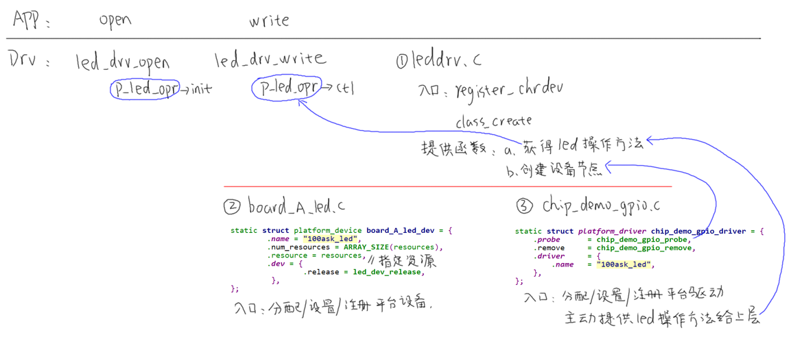
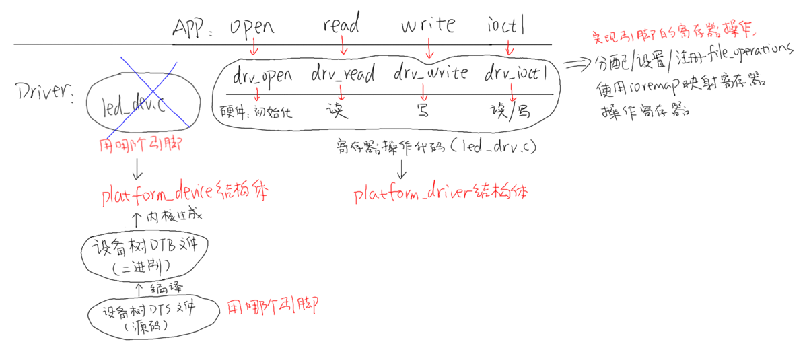

# 各个驱动例子的说明

教程可参考 100ask的 《嵌入式Linux应用开发完全手册V4.0_韦东山全系列视频文档-IMX6ULL开发板》 手册 和 配套视频，或其它家的（比如原子、野火等等），这里不是教程。文字 和 图片 来自 100ask，侵删。这里以 i.mx6ull 的 IO 操作为例。

在 shell 中显示内核驱动使用 printk() 打印的信息：

```bash
echo "7 4 1 7" > /proc/sys/kernel/printk
// 打开内核的打印信息，有些板子默认打开了
```

## 名词说明

（注，下文的描述是 严格使用 下面的名词来写的）

注册设备和创建设备：注册的设备 register_chrdev 在 proc/devices/xxx 里面显示，这是 设备名；创建的设备 device_create 在 dev/xxx0,1... 里面显示，这是 设备文件名。

驱动程序：led_drv.c，即填充 基本 文件IO操作API结构体struct file_operations 和 编写模块加载、卸载函数 的文件，驱动的顶层文件，一般要写的简约、漂亮，支持多种板子和外设。

外设资源文件：提供和指定有哪些设备资源，一般独立出来为 "device"。对应 "设备树" 和 "platform_device" 的作用。

外设操作文件：比如直接操作芯片寄存器来控制外设，一般独立出来为 "driver"，通过 "外设资源文件" 获取到 "device" 的资源，然后将自己的外设操作API提供给 "驱动程序"。对应 "platform_driver" 的作用。

## 文件夹说明

### led_drv_simple

为基本的驱动程序，填充 基本 文件 IO 操作 API 结构体 struct file_operations 和 编写 模块加载、卸载函数。

参考的 100ask 的 00_led_drv_simple。

### 进化1_外设操作和驱动程序分离

参照 struct file_operations 面向对象的思想，**将外设操作 API 也都填充到一个结构体里面，供 驱动程序 调用，保持 驱动程序 的通用、简洁**。

设备的初始化、反初始化、控制等等，都在另一个文件 做。定义一个外设的初始化、操作等的结构体 struct led_operations；对于同一个板子来说，使外设操作 API 都聚集在 另外创建的 外设操作文件 里面，然后将这些 API 填充进这个结构体，驱动程序只管调用这个结构体里面的函数成员。

程序补充说明：

- 设备类 通常对应于一种外设（比如 IO 外设，如设备/驱动文件： /dev/100ask_led），通过 字符串 设备类名词 区分；这个类下面可以有多个子设备（比如 IO 外设中 的具体的 哪一个/一些 IO，如设备/驱动文件： /dev/100ask_led0,1,...），子设备一般都是相同的主设备号 而通过 次设备号 的不同来区分。

- 因此 模块加载的时候会 根据设定 创建多个 设备/子设备，即多个 驱动文件（属于一个设备类，主设备号相同，次设备号不同）。

- 本例程就是 在一个设备类里面创建了多个子设备。即 下面这段，创建了一个设备类下面的多个子设备/驱动文件。

  ```c
  for (i = 0; i < LED_NUM; i++)
      device_create(led_class, NULL, MKDEV(major, i), NULL, "100ask_led%d", i); /* /dev/100ask_led0,1,... */
  ```

- 在 xxx_write() 和 xxx_read() 函数里面，实际控制一个设备类下面的哪一个设备，根据子设备号，获取通过 file_inode() 根据 file 得到文件的 inode，再用 iminor() 根据 inode 得到子设备号。

- 在 xxx_open() 和 xxx_close() 里面 可以根据 int minor = iminor(node); 直接获得次设备号（来或者这一个外设的哪一个具体资源）。

参考的 100ask 的 01_led_drv_template。

### 进化2_支持多种板子

还是用 进化1 里面的外设操作API结构体 struct led_operations，然后 **各个不同的板子的驱动 API 的接口都统一**，即 不同的板子的外设操作API的函数 编写的时候都按照这个结构体成员的格式。一个板子一个.c文件，里面去实现外设的操作并将操作API填充进这个结构体，供 驱动程序 调用即可。

编译时候，选择用哪个板子，就是在 makefile文件里面的 100ask_led-y := leddrv.o board_100ask_imx6ull-qemu.o 来区分，到底编译哪一个板子对应的驱动程序。

参考的 10ask 的 02_led_drv_for_boards。

在这里，我觉得，STM32 的 HAL 库就是很好的底层驱动框架，可以类似去写操作芯片寄存器的驱动代码，形成 HAL 库，然后在驱动程序里面就调用一些这个 HAL 库的 API，多好！！！（但是，这种给 SoC 建立 HAL库 相比于 后面 设备资源与外设操作分离的建模思想 就显得疲软了）

### 进化3_外设资源和外设操作分离

**外设资源文件**：外设资源由 board_A_led.c 和 led_resource.h 提供，里面描述了 用哪些 资源，比如哪个引脚、如何初始化 等等，然后**提供给 外设操作文件**。

```c
static struct led_resource board_A_led = { /* 例程中，在这里面描述了用哪一个引脚 */
	.pin = GROUP_PIN(3,1),
};
```

**外设操作文件**：外设操作由 chip_demo_gpio.c 和 led_opr.h 提供（这里与 进化1 保持类似），里面仍然是 定义外设的初始化、操作等的结构体 struct led_operations，然后**根据 外设资源文件 提供的外设描述信息**（用哪些东西、怎么初始化，还有寄存器的具体地址 等等）来 真正操作 寄存器 来操控外设 进行 初始化、设置、读出等等操作。外设操作文件 里面所用到的资源（包括寄存器地址）都是 外设资源文件 给到的，这样保持 外设操作文件 的通用性。

```c
static struct led_operations board_demo_led_opr = { /* 例程中，在这里将 外设操作 API 填充进 struct led_operations 结构体，供 驱动程序 调用 */
	.init = board_demo_led_init,
	.ctl  = board_demo_led_ctl,
};
```

参考的 10ask 的 03_led_drv_template_seperate。

### 进化4_总线设备驱动模型

**使用 内核提供的、标准的 platform_device / platform_driver 结构体来分别替代 进化3 中的 struct led_resource 和 struct led_operations，同样是 外设资源和外设操作分离 思想。**因此主要就是 填充结构体 struct platform_device 并注册，填充 结构体 struct platform_driver 并注册。

关于 总线设备驱动模型 的更多解释：[总线设备驱动框架1_欧阳海宾的博客-CSDN博客](https://blog.csdn.net/oyhb_1992/article/details/77140439)，[Linux Platform驱动模型(一) _设备信息_Neilo_chen的博客-CSDN博客](https://blog.csdn.net/cjianeng/article/details/122776618)。

程序额外说明：

- **board_A_led.c（外设资源文件）里面，填充结构体 struct platform_device 并注册 platform_device_register()**。

- **chip_demo_gpio.c（外设操作文件） 里面，填充 结构体 struct platform_driver 并注册 platform_driver_register()，并给驱动程序提供 外设操作 API 结构体**。

- 因此 编译出来的 borad_A_led.ko 对应 platform_device 这就是提供设备资源的，chip_demo_gpio.ko 对应 platform_driver 这就是提供设备操作的，这样说比较分得清。

- platform_device / platform_driver 在注册进内核时候，内核会根据 name 进行相互匹配。platform_device 有 唯一的 name 成员，platform_driver 有 唯一的 name 成员 和 一个 id_table 里面的多个 name 成员。匹配时候 比较三次 如下图。**因此 platform_driver 可能对应多个 platform_device**，而 platform_device 只对应一个 platform_driver。内核中有很多现成的 platform_driver。

  

- **当 platform_device 与 platform_driver 匹配成功的时候会调用 platform_driver 里面的 probe 成员指定的函数，在这里面 获取设备资源、记录资源**（不用在需要操作设备资源的时候再临时获取一下），**然后创建 设备/子设备 device_create**（且程序上写的是，在 设备资源 platform_device  里面 定义了几个设备 就创建几个 设备）如下图。（在创建 设备 之前应先创建好设备类 class_create，这个写在了 leddrv.c 里面，因此要设计 chip_demo_gpio.c（这里面创建设备） 依赖 leddrv.c（这里面创建类），因此才能保证 加载模块的时候 应该先加载 驱动程序 leddrv.ko 再加载 外设操作模块 chip_demo_gpio.ko 的顺序，最后加载 设备资源模块 borad_A_led.ko。100ask 的例子是这样做的，或许可以用其它的方式来做也达到这样的顺序）。 

  

- 对于 struct platform_device，程序中还提供了一个空函数 led_dev_release，这个函数在用 platform_device_unregister 卸载 platform_device 时会被调用，如果不提供的话内核会打印警告信息。

**总结一下**：

1. leddrv.c 里面 填充 struct file_operations 和 编写 模块加载、卸载函数。其中 模块加载函数里面：注册字符设备 register_chrdev、创建设备类 class_create。
2. board_A_led.c（外设资源文件）里面，填充结构体 struct platform_device 并注册 platform_device_register()。其中 在 struct resource 结构体里面 描述 子设备 的资源。
3. chip_demo_gpio.c（外设操作文件） 里面，填充 结构体 struct platform_driver 并注册 platform_driver_register()，并给驱动程序提供 外设操作 API 结构体 struct led_operations。其中 当 platform_device 与 platform_driver 匹配成功的时候会调用 platform_driver 里面的 probe 成员指定的函数，在这里面 获取设备资源 platform_get_resource()、记录资源，然后创建 设备/子设备 device_create。
4. 其它的与 进化3 类似。
5. 一般加载模块 insmod 的时候，先加载 驱动程序的模块 leddrv.ko，再加载 driver 的模块 做好驱动的准备，最后加载  device 的模块 这时才创建了设备文件。这个顺序可以自行用 程序的依赖关系 或者 有意识的按照循序操作 来保证。

参考的 10ask 的 04_led_drv_template_bus_dev_drv。

（虽然 100ask 的文件命名不够清晰和规范、教程例子都是临时另搓出来的，但是循序渐进的教程思想还是可以的）

### 进化5_由设备树定义外设资源

引入设备树（使用设备树的前提是内核中已经有对应的驱动程序，即 platform_driver）来指定 外设资源，内核解析设备树，并自动的构造出 platform_device 再注册进内核。**即 platform_device 这部分工作由 设备树替代了**，下图描述，左边。



**因此 本例程中 board_A_led.c（外设资源文件）和 led_resource.h 就用不上了，因为用 设备树 替代了，Makefile 中就可以去掉 board_A_led 了**。

设备树参考教程 [主线剧情-番外02-设备树详解_Real-Staok的博客-CSDN博客](https://blog.csdn.net/Staokgo/article/details/124282815)。

#### 板子上查看设备树、平台设备和平台驱动

> 可以在 shell 中**查看当前已经装载的设备树**：`/sys/firmware/devicetree` 目录下是以目录结构程现的dtb文件, 根节点对应base目录, 每一个节点对应一个目录, 每一个属性对应一个文件。**这些属性的值如果是字符串，可以使用cat命令把它打印出来；对于数值，可以用hexdump把它打印出来**。（一个单板启动时，u-boot先运行，它的作用是启动内核。U-boot会把内核和设备树文件都读入内存，然后启动内核。在启动内核时会把设备树在内存中的地址告诉内核。）
>
> platform_device 的信息：`/sys/devices/platform` 目录含有注册进内核的所有 platform_device。一个设备对应一个目录，进入某个目录后，如果它有 “driver” 子目录，就表示这个platform_device跟某个platform_driver配对了。**设备树被系统解析后生成的 platform_device 可以在这里面找到**。
>
> platform_driver 的信息：`/sys/bus/platform/drivers` 目录含有注册进内核的所有 platform_driver。一个driver对应一个目录，进入某个目录后，如果它有配对的设备，可以直接看到（一个平台设备只能配对一个平台驱动，一个平台驱动可以配对多个平台设备）。在装载 驱动程序中的 driver 的模块 之后就可以在 这个目录看到对应的 driver。

#### 板子更新设备树

更新设备树：

- 首先编译：根据开发板，设置 ARCH、CROSS_COMPILE、PATH 这三个环境变量后，进入 ubuntu 上板子内核源码的目录，执行如下命令即可编译 dtb文件：`make dtbs`，编译出的设备树文件是：内核源码目录中 `arch/arm/boot/dts/imx6ull-14x14-ebf.dtb`（这里以 野火 imx6ull-pro 为例）。
- 然后替换：板子启动后，在里面更换这个文件：`/boot/imx6ull-14x14-ebf.dtb`，板子重启一下 系统便重新装载和解析了新的设备树。

#### 设备树的解析、构造 device 和 匹配 driver

> 设备树的解析 构造 device_node、platform_device 过程如下：
>
> ① dts在PC机上被编译为dtb文件。
>
> ② u-boot把dtb文件传给内核。
>
> ③ 内核解析dtb文件，把**每一个**节点都转换为device_node结构体。
>
> ④ 对于**某些**device_node结构体，会被转换为platform_device结构体。
>

支持设备树的 platform_device 和 支持设备树的 platform_driver 的匹配：

- 比较 `platform_device.dev.of_node` 和 `platform_driver.driver.of_match_table`。这两个 结构体的成员介绍看 `驱动例子中的API总结说明.md` 里面的 `总线平台驱动相关` 一节。

- 具体来说，支持设备树的 platform_device 的 struct device dev 成员的 struct device_node *of_node 中的 struct property *properties 含有 compatible 属性，用于匹配 支持设备树的 driver。

- 具体来说，支持设备树的 platform_driver 的 struct device_driver driver 成员的 const struct of_device_id *of_match_table 里面的 compatible 成员，用于匹配支持设备树的 device。

- > 使用设备树信息来判断dev和drv是否配对时：
  >
  > 首先，如果of_match_table中含有compatible值，就跟dev的compatile属性比较，若一致则成功，否则返回失败；
  >
  > 其次，如果of_match_table中含有type值，就跟dev的device_type属性比较，若一致则成功，否则返回失败；
  >
  > 最后，如果of_match_table中含有name值，就跟dev的name属性比较，若一致则成功，否则返回失败。
  >
  > 而设备树中建议不再使用devcie_type和name属性，所以基本上只使用设备节点的compatible属性来寻找匹配的platform_driver。

- 另外还有三次匹配，是前面讲到的：`platform_device / platform_driver 在注册进内核时候，内核会根据 name 进行相互匹配。platform_device 有 唯一的 name 成员，platform_driver 有 唯一的 name 成员 和 一个 id_table 里面的多个 name 成员。匹配时候 比较三次`。因此现在讲了这有四次匹配。

#### 从由设备树转换来的 platform_device 里面获取资源

> device_node 怎么转换为 platform_device 结构体的：
>
> A. platform_device 中含有 resource数组，它来自 device_node 的 reg、interrupts属性。**这些是标准的，可以使用 platform_get_resource() 来获取资源。**
>
> 比如 对于设备树节点中的 reg 属性，它对应 IORESOURCE_MEM 类型的资源；对于设备树节点中的 interrupts 属性，它对应 IORESOURCE_IRQ 类型的资源。
>
> B. platform_device.dev.of_node 指向 device_node，可以通过它获得其他属性。**这些对于那些非标准的资源，看下一节，通过 device_node 从节点获取资源。**

#### 从没有转换为 platform_device 的设备树节点获取资源

> 内核源码中 include/linux/ 目录下有很多 of 开头的头文件，使用这些 API。
>
> 设备树的处理过程是：dtb -> device_node -> platform_device。

设备树中的每一个节点，在内核里都有一个 device_node。（可以使用 device_node 去找到对应的 platform_device）。

现在我们是不通过 platform_device 而是**通过 device_node 来获取节点上的资源**。任意驱动程序里，都可以直接访问设备树。

根据 platform_device  来找：struct platform_device 下面的 dev.of_node 就是这个 device 对应 设备树节点的 struct device_node。

> 首先是找到节点：在 of.h 里
>
> - of_find_node_by_path，根据路径字符串 返回 节点结构体 struct device_node。
> - of_find_compatible_node，根据 compatible 属性，节点如果定义了 compatible 属性，传入 compatible 属性值 字符串 来找到 节点。
> - of_find_node_by_name，节点如果定义了 name 属性，那我们可以根据名字找到它。但是在设备树的官方规范中不建议使用“name”属性，所以这函数也不建议使用，of_find_node_by_type 同理。
> - of_find_node_by_phandle。
> - of_get_parent，of_get_next_child，of_get_next_available_child，of_get_child_by_name。
> - 这些都返回 节点结构体 struct device_node。
>
> 然后根据 节点 struct device_node 和 属性名字 找到属性结构体 struct property 并获取它的值：在 of.h 里
>
> - of_find_property。
> - of_get_property。
> - of_property_count_elems_of_size，根据名字找到节点的属性，确定它的值有多少个元素。
> - of_property_read_u32，of_property_read_u64，读整数u32/u64。
> - 读数组：of_property_read_variable_u8/u16/u32/u64_array。
> - 读字符串：of_property_read_string。
>
> 大部分 API 更多如下：
>
> - of.h        // 声明了 device_node 和属性 property 的操作函数。提供设备树的一般处理函数, 比如 of_property_read_u32(读取某个属性的u32值), of_get_child_count(获取某个device_node的子节点数)
> - of_address.h    // 地址相关的函数, 比如 of_get_address(获得reg属性中的addr, size值), of_match_device (从matches数组中取出与当前设备最匹配的一项)
> - of_dma.h      // 设备树中DMA相关属性的函数
> - of_gpio.h     // GPIO相关的函数
> - of_graph.h     // GPU相关驱动中用到的函数, 从设备树中获得GPU信息
> - of_iommu.h     // 很少用到
> - of_irq.h      // 中断相关的函数
> - of_mdio.h     // MDIO (Ethernet PHY) API
> - of_net.h      // OF helpers for network devices. 
> - of_pci.h      // PCI相关函数
> - of_pdt.h      // 很少用到
>
> 
>
> - of_reserved_mem.h            // reserved_mem的相关函数
>
> - of_platform.h   // 把device_node转换为platform_device时用到的函数, 
>
>   ​          // 比如of_device_alloc(根据device_node分配设置platform_device), 
>
>   ​          // of_find_device_by_node (根据device_node查找到platform_device),
>
>   ​          //  of_platform_bus_probe (处理device_node及它的子节点)
>
> - of_device.h    // 设备相关的函数, 比如 of_match_device

#### 一般修改设备树的方法

> 一个写得好的驱动程序, 它会尽量确定所用资源。只把不能确定的资源留给设备树, 让设备树来指定。
>
> 根据原理图确定"驱动程序无法确定的硬件资源"，再在设备树文件中填写对应内容。
>
> **一般是驱动程序需要什么，设备树提供什么，按需来**，即 驱动要求设备树节点提供什么，我们就得按这要求去编写设备树。
>
> **使用芯片厂家提供的工具**
>
> 有些芯片，厂家提供了对应的设备树生成工具，可以选择某个引脚用于某些功能，就可以自动生成设备树节点。
>
> 你再把这些节点复制到内核的设备树文件里即可。
>
> **看绑定文档**
>
> 内核文档 Documentation/devicetree/bindings/。做得好的厂家也会提供设备树的说明文档。
>
> **参考同类型单板的设备树文件**
>
> **网上搜索**
>
> **实在没办法时**, 只能去研究驱动源码

参考的 10ask 的 05_led_drv_template_device_tree。视频讲解 [读取设备树提供的资源—【第5篇】嵌入式Linux驱动开发基础知识_哔哩哔哩_bilibili](https://www.bilibili.com/video/BV14f4y1Q7ti?p=24)。
